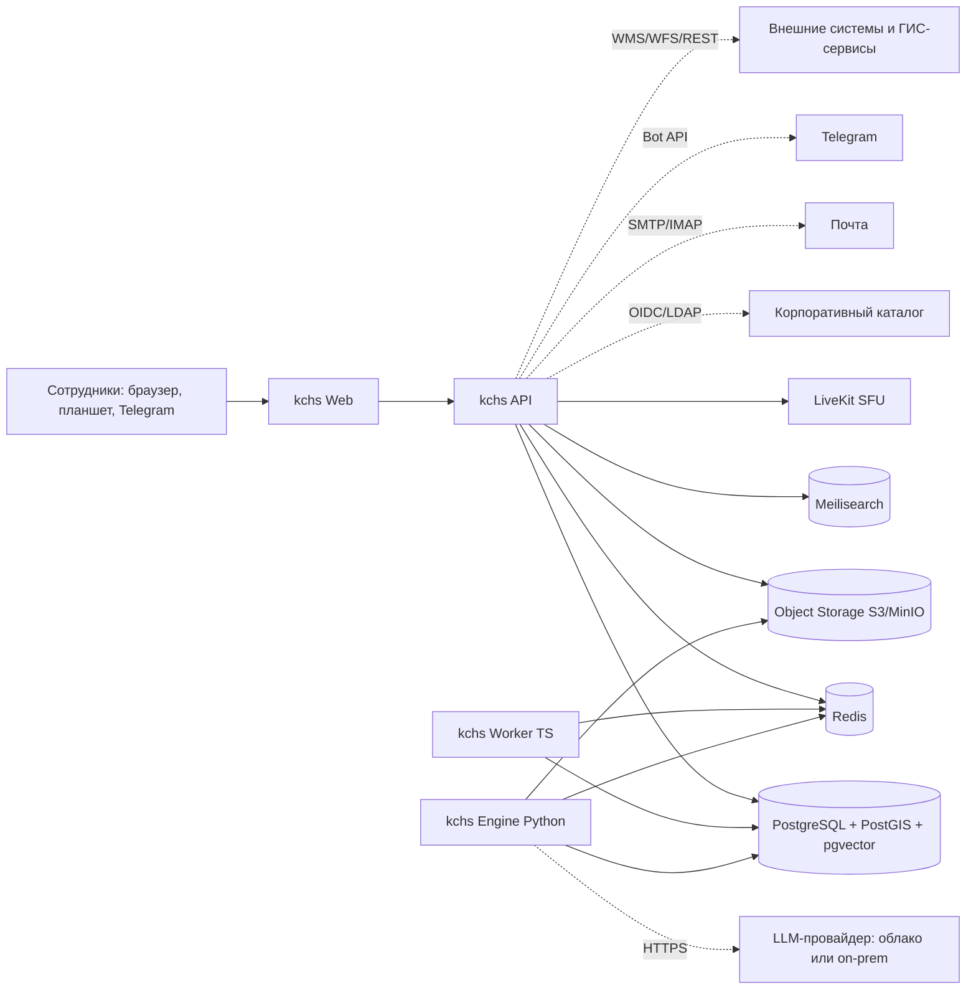
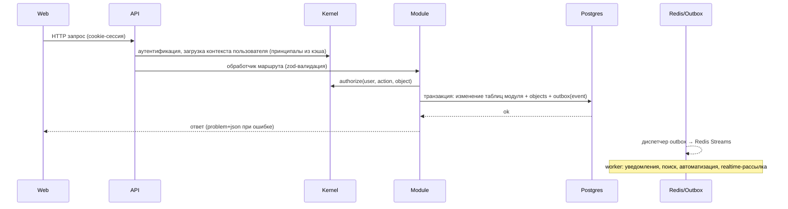

# Архитектура: обзор

## Архитектурная идея

kchs — **модульный монолит** на TypeScript с выделенным **вычислительным движком** на Python, поверх **одной базы данных** (PostgreSQL + PostGIS) и минимального набора инфраструктурных сервисов. Все модули продукта строятся на общем **ядре платформы** (реестр объектов, доступ, события, связи, обсуждения, уведомления, задания, процессы, поиск, realtime). Клиент — одностраничное веб-приложение с оболочкой «рабочее пространство».

Статус: **Решено** (ADR-0001, ADR-0002, ADR-0003).

## Почему так

| Вариант | Плюсы | Минусы | Вывод |
|---|---|---|---|
| Микросервисы по модулям | независимое масштабирование, изоляция команд | распределённые транзакции между объектами, доступом и событиями; тринадцать областей = десятки сервисов; эксплуатация on-prem невозможна малой командой | отклонено |
| Монолит без модулей | простота | быстро превращается в клубок; ядро не выделяется | отклонено |
| **Модульный монолит + движок** | одна транзакция для объекта+ACL+событие; общие механизмы естественны; одна поставка; масштабируется репликами и ролями процессов; тяжёлые вычисления вынесены | требует дисциплины границ (обеспечивается линтером и структурой) | **выбрано** |

Python-движок оправдан конкретными библиотеками, которых нет или которые слабы в Node: GDAL/pyogrio (геоформаты и проекции), pandas/pyarrow/DuckDB (данные), docxtpl/LibreOffice (документы), tesseract (OCR), faster-whisper (расшифровка), sentence-transformers (эмбеддинги). Движок **не содержит доменной логики**: он выполняет задания из очереди и возвращает результаты.

## Контекст системы



## Контейнеры (развёртываемые единицы)

| Контейнер | Технология | Ответственность |
|---|---|---|
| `web` | React SPA (Vite), статика за реверс-прокси | Оболочка рабочего пространства, все экраны |
| `api` | Node.js 22, Fastify, TypeScript | HTTP API, WebSocket-шлюз, сервер совместного редактирования (Hocuspocus), тайлы, авторизация |
| `worker` | тот же код, что `api`, роль `worker` | Потребители событий (уведомления, индексация, автоматизация, вебхуки), таймеры процессов, отложенные задания |
| `engine` | Python 3.12, FastAPI (внутренний), потребитель BullMQ | Импорт/экспорт данных и геоданных, преобразования, DuckDB-запросы, рендеринг отчётов/карт (Playwright), конвертации, OCR, расшифровка, эмбеддинги, LLM-задания |
| `postgres` | PostgreSQL 17 + PostGIS 3.5 + pgvector + pg_trgm | Система записи: всё, включая таблицы датасетов |
| `redis` | Redis 7 (или Valkey) | Очереди BullMQ, pub/sub realtime, кэш, rate limit, presence |
| `minio` | S3-совместимое хранилище | Файлы, версии, превью, записи встреч, Parquet, PMTiles, экспорт |
| `meilisearch` | Meilisearch | Полнотекстовый индекс объектов, файлов, сообщений |
| `livekit` | LiveKit server + Egress + встроенный TURN | Аудио/видео, демонстрация экрана, запись |
| `proxy` | Caddy (или nginx) | TLS, маршрутизация, сжатие, статика |
| `observability` | Prometheus, Grafana, Loki, Tempo | Метрики, логи, трассы |
| `onlyoffice` (опц.) | ONLYOFFICE Document Server | Совместное редактирование офисных файлов |

Один сервер (S1) поднимает всё через `docker compose`. В S2 контейнеры `api`, `worker`, `engine` масштабируются горизонтально; данные — по стандартным схемам (реплики, распределённый MinIO). Подробности: `15-admin-operations.md`.

## Внутренняя структура `api`

```
apps/api/src
├── main.ts                 # bootstrap; ROLE=api|worker|all
├── kernel/                 # ядро платформы (см. 02-platform-kernel.md)
│   ├── objects/            # реестр объектов, типы, корзина
│   ├── access/             # ACL, принципалы, политики, authorize()
│   ├── spaces/
│   ├── links/
│   ├── events/             # outbox, шина, подписчики
│   ├── activity/           # лента и аудит
│   ├── discussions/        # обсуждения (общие с чатами)
│   ├── notifications/      # уведомления, входящие, каналы
│   ├── search/             # индексация и запросы
│   ├── jobs/               # BullMQ, реестр заданий, прогресс
│   ├── process/            # движок процессов
│   ├── realtime/           # WebSocket, комнаты, presence
│   ├── fields/             # система типов полей и форм
│   ├── views/              # сохранённые представления
│   ├── storage/            # S3, ключи, подписанные URL
│   ├── settings/           # системные/пространств/пользовательские настройки
│   └── i18n/, calendar/, audit/
├── modules/
│   ├── identity/  spaces-ui/  data/  gis/  documents/  files/  tasks/
│   ├── comms/  meetings/  calendar/  knowledge/  automation/  ai/  admin/
│   └── <module>/
│       ├── module.ts       # регистрация: типы объектов, маршруты, подписчики, политики, задания
│       ├── public.ts       # публичный API модуля для других модулей
│       ├── domain/         # сущности, сервисы, инварианты
│       ├── infra/          # репозитории (Drizzle), адаптеры
│       ├── http/           # маршруты + zod-схемы
│       ├── jobs/           # обработчики заданий
│       ├── events/         # подписчики событий
│       └── __tests__/
└── shared/                 # db, config, logger, errors, http utils
```

Правила границ (проверяются `dependency-cruiser`):
- `modules/*` могут импортировать `kernel/*`, `shared/*`, `packages/*` и `modules/<other>/public.ts`. Ничего больше из чужих модулей.
- `kernel/*` не импортирует `modules/*`. Ядро знает о типах объектов только через реестр, который модули заполняют при старте.
- Таблицы модуля — только через его репозитории.

## Как модули взаимодействуют

1. **Синхронно через ядро.** `ObjectService.create(...)`, `authorize(...)`, `LinkService.link(...)`, `DiscussionService.post(...)`, `JobService.enqueue(...)`, `ProcessService.start(...)`.
2. **Синхронно через публичный API модуля.** Например, `documents` вызывает `tasks.public.createInstruction(...)`, `meetings` вызывает `documents.public.registerFromProtocol(...)`. Публичный API — узкий, типизированный, с зафиксированными контрактами.
3. **Асинхронно через события.** `dataset.imported` → `gis` инвалидирует кэш тайлов; `document.registered` → `automation` запускает правила; `task.completed` → `documents` проверяет исполнение резолюции.

Правило выбора: если действие должно произойти **в той же транзакции** и его отсутствие — ошибка (создание поручений при подтверждении протокола) — синхронный вызов. Если действие — реакция, допускающая задержку и повторы (уведомить, проиндексировать, пересчитать) — событие.

## Сквозные потоки

### Запрос пользователя



### Тяжёлая операция (импорт файла)

Web → `POST /datasets/{id}/imports` → API создаёт задание (`imports` очередь) → Engine выполняет (чтение, типизация, COPY в staging, валидация, коммит) → прогресс публикуется в Redis → WebSocket → UI; по завершении событие `dataset.imported` → инвалидация кэшей, индексация, уведомление.

### Realtime

Клиент подписывается на комнаты открытых вкладок (`object:{id}`), пространства и пользователя. Подписчик событий `realtime` в worker публикует компактные сообщения (`object.updated`, `message.posted`, `job.progress`, `presence`) в Redis pub/sub; API-инстансы рассылают их в комнаты. Совместное редактирование текста — отдельный протокол Yjs через Hocuspocus на пути `/collab`.

## Данные: три слоя хранения в одном Postgres

| Слой | Схема | Что хранит |
|---|---|---|
| Платформа и модули | `public` (через Drizzle) | Пользователи, объекты, ACL, документы, задачи, метаданные датасетов и т.д. |
| Датасеты | `ds` | Физические таблицы датасетов `ds.t_<id>` с системными столбцами и геометрией; истории строк `ds.h_<id>` |
| Служебные | `ops` | Outbox, кэш тайлов (опц.), очереди процессов, метрики |

Колоночный tier (Parquet в S3 + DuckDB в engine) — расширение для сценария S2+, за тем же интерфейсом запросов (см. `06-analytics-engine.md`).

## Пакеты, общие для клиента и сервера

`packages/contracts` (zod-схемы, типы, OpenAPI), `packages/query` (QuerySpec, язык выражений, компилятор SQL), `packages/fields` (система типов полей, форматирование, валидация), `packages/map-style` (LayerStyle → стиль MapLibre), `packages/chart-spec` (ChartSpec → ECharts), `packages/process` (схема определений процессов), `packages/ui` (дизайн-система), `packages/i18n`.

Сквозные контракты описаны в `docs/contracts/`. Они — «позвоночник» продукта: их менять только через ADR.

## Нефункциональные ориентиры

| Аспект | Ориентир |
|---|---|
| Отклик UI на действие | ≤ 100 мс локально; данные — скелетоны и оптимистичные обновления |
| Первая загрузка приложения | ≤ 3 с на корпоративной сети; код разбит по модулям |
| Интерактивный запрос (≤ 10 млн строк) | p95 ≤ 2 с; результаты кэшируются по версии датасета |
| Тайлы | p95 ≤ 50 мс из кэша, ≤ 300 мс без |
| Realtime-доставка | ≤ 500 мс от коммита до клиента |
| Доступность | 99.5 % в S1 (плановые окна ночью), 99.9 % в S2 |
| Потеря данных | RPO ≤ 15 мин (WAL-архив), RTO ≤ 1 ч (S1) |
| Безопасность | см. `17-security.md`: MFA, аудит, политики строк, минимальные привилегии |
