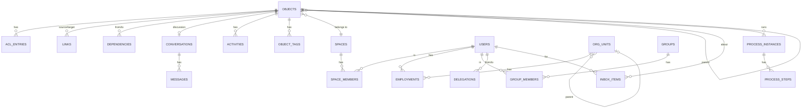
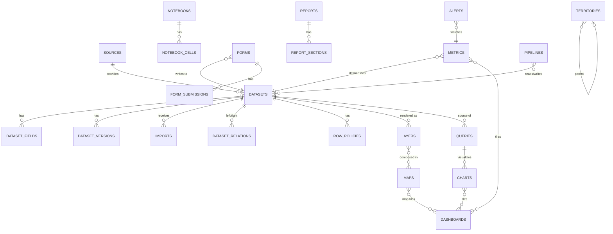
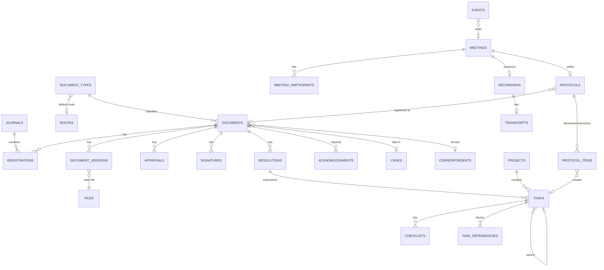

# Предметная модель

Статус: **Решено** для ядра и главных сущностей; детали полей — **Рекомендовано**.

## Карта типов объектов

Все сущности ниже, помеченные ★, — объекты реестра (`objects`). Остальные — вспомогательные записи, принадлежащие объектам.

| Область | Объекты ★ | Вспомогательные |
|---|---|---|
| Ядро | `space`, `folder` (раздел/папка), `view` | `acl_entries`, `links`, `dependencies`, `tags`, `favorites`, `recent_views`, `activities`, `audit_log`, `notifications`, `inbox_items`, `jobs`, `process_*`, `settings` |
| Идентификация | — (`user` — не объект реестра, но адресуем в пикерах и упоминаниях) | `users`, `credentials`, `sessions`, `mfa_factors`, `org_units`, `positions`, `employments`, `groups`, `roles`, `delegations` |
| Данные | `source`, `dataset`, `pipeline`, `query`, `metric`, `chart`, `dashboard`, `notebook`, `report`, `form`, `alert` | `dataset_fields`, `dataset_versions`, `imports`, `dataset_relations`, `row_policies`, `column_policies`, `query_runs`, `form_submissions`, `quality_rules`, `quality_results` |
| GIS | `layer`, `map`, `territory`, `analysis`, `basemap` | `map_layers`, `map_bookmarks`, `map_annotations`, `tile_cache` |
| Документы | `document`, `document_type`, `journal`, `route`, `template`, `case`, `correspondent` | `document_versions`, `approvals`, `signatures`, `resolutions`, `acknowledgments`, `registrations` |
| Файлы | `file`, `folder` | `file_versions`, `file_shares`, `file_locks`, `file_texts` |
| Задачи | `project`, `task` | `task_statuses`, `checklists`, `task_dependencies`, `time_entries` |
| Коммуникации | `conversation` | `conversation_members`, `messages`, `reactions`, `read_marks`, `drafts` |
| Встречи | `meeting`, `recording`, `protocol` | `meeting_participants`, `transcripts`, `protocol_items` |
| Календарь | `calendar`, `event` | `event_attendees`, `reminders` |
| Знания | `page` | `page_versions`, `acknowledgments` (общие с документами) |
| Автоматизация | `rule`, `integration`, `webhook` | `rule_runs`, `api_tokens`, `webhook_deliveries` |

## Диаграмма ядра

## Диаграмма данных и GIS

## Диаграмма документов, задач и встреч

## Ключевые сущности и их поля

### Пользователь и организация
- **User**: `id`, `login`, `email`, `phone`, `display_name`, `first/last/middle_name`, `locale`, `timezone`, `avatar_file_id`, `status (active|blocked|invited|deactivated)`, `attributes jsonb` (для политик: `territory_codes`, `clearance`), `last_seen_at`.
- **OrgUnit**: `id`, `parent_id`, `code`, `name {ru,tg,en}`, `kind (committee|department|division|regional|sector)`, `head_user_id`, `territory_id?`, `sort`.
- **Position**: `id`, `name`, `rank`, `unit_id?`.
- **Employment**: `user_id`, `unit_id`, `position_id`, `is_primary`, `from`, `to`.

### Датасет
- **Dataset** ★: `kind (managed|external_sync|query_view|reference)`, `storage (pg|parquet)`, `source_id?`, `primary_key[]`, `geometry {field, type, srid}?`, `time_field?`, `territory_field?`, `row_count`, `current_version`, `settings {track_history, editable, tile_fields, generalize}`, `freshness {last_import_at, schedule}`, `description`, `steward_id`.
- **DatasetField**: `id`, `dataset_id`, `key` (стабильный, `c_<short>` физически), `label {ru,tg,en}`, `type` (из `contracts/field-types.md`), `semantic (dimension|measure|identifier|geometry|time|territory|category|text|lookup)`, `format`, `unit`, `nullable`, `indexed`, `sensitive`, `lookup {dataset_id, key_field, label_field}?`, `formula?`, `description`, `order`.
- **DatasetVersion**: `id`, `dataset_id`, `number`, `created_at`, `created_by`, `origin (import|edit|pipeline|form|analysis)`, `row_count`, `diff {added, changed, removed}`, `parquet_key?`, `schema_snapshot`.
- **DatasetRelation**: `left_dataset_id`, `left_field`, `right_dataset_id`, `right_field`, `cardinality (1:1|1:n|n:1)`, `label`.

### Запросы и визуализация
- **Query** ★: `spec` (QuerySpec), `compiled_sql` (кэш), `params_schema`, `mode (visual|sql)`, `dataset_ids[]` (для зависимостей).
- **Metric** ★: `dataset_id`, `measure {agg, field|expr}`, `filters`, `dimensions_allowed[]`, `time_field`, `unit`, `format`, `direction (higher_better|lower_better)`, `targets [{dimension?, value, period}]`, `thresholds [{level, op, value}]`, `owner`.
- **Chart** ★: `query_id|inline_spec`, `chart` (ChartSpec), `params_defaults`.
- **Dashboard** ★: `layout [{tile_id, x,y,w,h}]`, `tiles [{kind: chart|metric|map|text|filter|table|image, ref, options}]`, `filters [{key, field_binding[], type, default}]`, `refresh_interval`, `theme`, `tv_mode`.
- **Notebook** ★: `cells [{id, kind: text|query|chart|map|dataset|metric|ai|image, content, output_cache_key}]`, `params`.
- **Report** ★: `template {page, header/footer, sections[]}`, `params_schema`, `output_formats`, `schedule`, `distribution`, `register_as_document_type_id?`.
- **Form** ★: `dataset_id`, `schema` (поля формы → поля датасета), `assignments [{principal, due_rule}]`, `period (daily|weekly|monthly|once)`, `settings {allow_edit_after_submit, require_approval}`.
- **Alert** ★: `metric_id`, `condition`, `dimensions?`, `schedule`, `channels`, `recipients`, `cooldown`.

### GIS
- **Layer** ★: `dataset_id`, `style` (LayerStyle), `popup_template`, `label`, `min_zoom`, `max_zoom`, `filter`, `editable`, `moderated`, `tile_fields[]`, `legend`.
- **Map** ★: `basemap_id`, `view {center, zoom, bearing, pitch}`, `layers [{layer_id, visible, opacity, order, group}]`, `widgets [...]`, `bookmarks`, `filters_binding`, `time {field, range}`.
- **Territory** ★: `code` (официальный), `parent_id`, `level (country|region|district|jamoat|settlement)`, `name {ru,tg,en}`, `geom`, `centroid`, `area`, `population?`, `attributes jsonb`. Хранится как справочный датасет (`reference`) с зеркалом в таблице `territories` для быстрых соединений и ACL.
- **Analysis** ★: `kind`, `params`, `input_dataset_ids[]`, `output_dataset_id`, `status`, `job_id`.

### Документы
- **DocumentType** ★: `key`, `name`, `direction (incoming|outgoing|internal)`, `card_schema` (поля), `numbering {journal_id, format}`, `default_route_id`, `retention_years`, `confidentiality_allowed[]`, `print_forms[]`, `settings {require_scan, allow_resolution, ack_on_register}`.
- **Document** ★: `type_id`, `status`, `reg_number`, `reg_date`, `journal_id`, `subject`, `summary`, `correspondent_id?`, `outgoing_number/date` (для входящих — реквизиты корреспондента), `author_id`, `responsible_id`, `signer_id`, `deadline`, `control (none|on|done)`, `controller_id`, `confidentiality`, `fields jsonb` (по `card_schema`), `current_version_id`, `case_id?`, `territory_id?`.
- **DocumentVersion**: `number`, `main_file_id`, `attachments[]`, `created_by`, `note`, `hash`, `pdf_file_id` (для просмотра/подписи), `is_final`.
- **Registration**: `document_id`, `journal_id`, `number`, `sequence`, `year`, `registered_by`, `registered_at`.
- **Approval**: `document_id`, `version_id`, `process_step_id`, `approver_id`, `on_behalf_of?`, `decision (approved|rejected|remarks)`, `comment`, `decided_at`, `remarks_file_id?`.
- **Signature**: `document_id`, `version_id`, `signer_id`, `kind (simple|qualified)`, `hash`, `signed_at`, `certificate jsonb?`, `sheet_file_id`.
- **Resolution**: `document_id`, `author_id`, `text`, `responsible_id`, `co_executors[]`, `deadline`, `control`, `controller_id`, `parent_resolution_id?`, `created_at`.
- **Case** ★: `index` (по номенклатуре), `title`, `year`, `retention`, `unit_id`, `status (open|closed|transferred|destroyed)`.
- **Correspondent** ★: `kind (organization|person)`, `name`, `details jsonb`, `contacts`.

### Задачи
- **Project** ★: `key`, `lead_id`, `status`, `start/end`, `workflow {statuses[], transitions}`, `custom_fields`, `board_settings`.
- **Task** ★: `kind (task|instruction|subtask|milestone)`, `key` (`PROJ-123` или `П-2026-0451` для поручений), `project_id?`, `parent_id?`, `status`, `priority`, `assignee_id`, `co_assignees[]`, `author_id`, `controller_id?`, `start_at`, `due_at`, `completed_at`, `accepted_at`, `requires_acceptance`, `result_text`, `source {object_id, kind: document|resolution|protocol|alert|form|message}`, `estimate`, `labels`, `fields jsonb`, `recurrence?`, `order`.

### Коммуникации и встречи
- **Conversation** ★: `kind (direct|group|channel|object)`, `object_id?`, `title`, `privacy (open|closed)`, `space_id`, `last_message_at`, `settings`.
- **Message**: `conversation_id`, `author_id`, `body` (Tiptap JSON + plain text), `kind (user|system|decision|action)`, `reply_to_id`, `thread_root_id`, `attachments[]`, `mentions[]`, `edited_at`, `deleted_at`, `meta`.
- **Meeting** ★: `kind (call|meeting)`, `title`, `organizer_id`, `starts_at`, `ends_at`, `room_name`, `status (scheduled|live|ended|cancelled)`, `agenda` (rich), `settings {record, transcribe, allow_guests, waiting_room}`, `event_id?`, `linked_object_ids[]`.
- **Recording**: `meeting_id`, `file_id`, `duration`, `status`, `transcript_status`.
- **Transcript**: `recording_id`, `language`, `segments [{start, end, speaker, text}]`, `summary`.
- **Protocol** ★: `meeting_id`, `body` (Tiptap JSON с блоками `decision`, `instruction`), `status (draft|confirmed|registered)`, `document_id?`.
- **ProtocolItem**: `protocol_id`, `kind (decision|instruction|note)`, `text`, `assignee_id?`, `due_at?`, `task_id?`, `order`.

### Календарь и знания
- **Calendar** ★: `kind (personal|team|resource)`, `owner`, `color`, `timezone`.
- **Event** ★: `calendar_id`, `title`, `starts_at`, `ends_at`, `all_day`, `rrule?`, `exdates[]`, `location`, `meeting_id?`, `visibility (public|private|busy)`, `reminders[]`, `linked_object_ids[]`.
- **Page** ★: `parent_id`, `body` (Yjs/Tiptap), `status (draft|published)`, `template_key?`, `owners[]`, `review_due_at?`, `ack_required`, `current_version`.

## Инварианты, за которыми следит ядро

1. У каждого объекта ровно одно пространство и ровно один владелец.
2. `objects.parent_id` не образует циклов; перенос пересчитывает `object_ancestors`.
3. Удаление объекта невозможно, пока на него есть `dependencies` с `kind='uses'` от активных объектов (показать список и предложить действия), кроме перемещения в корзину с предупреждением.
4. Любая запись в таблицы модуля в рамках одной транзакции с изменением `objects.updated_at` и outbox-событием.
5. Регистрационный номер документа уникален в журнале в пределах года; выдаётся в транзакции с блокировкой счётчика.
6. Поручение (`task.kind='instruction'`) не может быть завершено исполнителем без приёмки, если `requires_acceptance`.
7. Версия документа, отправленная на согласование, неизменяема; изменения создают новую версию.
