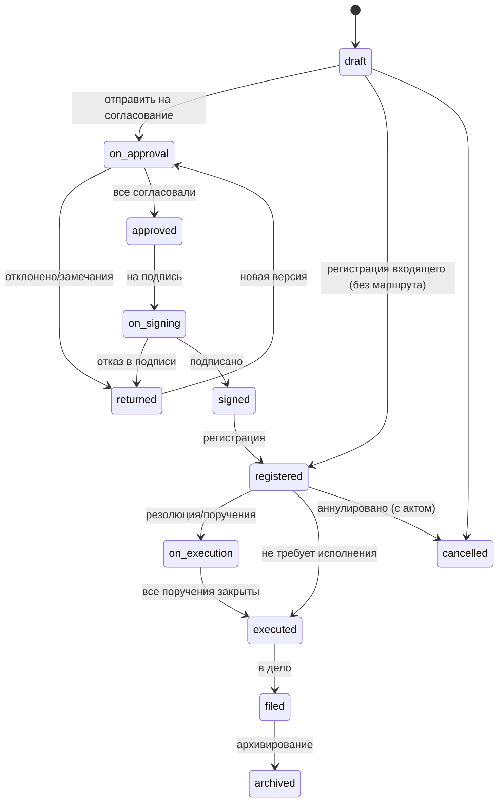

# Документооборот

Статус: **Решено** для жизненного цикла, регистрации, маршрутов через движок процессов, резолюций → поручений и контроля; **Рекомендовано** для архива и шаблонов; **Открыто** — квалифицированная электронная подпись.

## 1. Что такое документ в kchs

Документ — объект реестра с типом, карточкой (набор полей по схеме типа), версиями файлов, регистрационными реквизитами, маршрутом (процесс), резолюциями, поручениями, связями с другими документами и объектами (территория, датасет, дашборд, встреча), обсуждением и историей. Документ участвует в общих механизмах: поиск (включая текст вложений после OCR), Входящие, уведомления, шаринг, аудит.

## 2. Типы документов и карточки

`document_types` задаёт: направление (`incoming`/`outgoing`/`internal`), схему карточки (поля системы типов: текст, дата, корреспондент, подразделение, пользователь, территория, справочник, файл, число…), нумерацию (журнал и формат), маршрут по умолчанию, допустимые грифы, срок хранения, печатные формы, правила (обязателен скан, разрешены резолюции, ознакомление при регистрации, автоконтроль сроков).

Стартовый набор (seed, редактируемый): Входящее письмо, Исходящее письмо, Служебная записка, Докладная записка, Приказ, Распоряжение, Протокол, Договор/Соглашение, Обращение, Отчёт (регистрируемый), Донесение (для предметного пакета).

## 3. Жизненный цикл

Переходы выполняет движок процессов по определению маршрута типа документа; статусы документа — производные от состояния процесса и явных действий (регистрация, «в дело»). Ручное изменение статуса запрещено, кроме `cancelled` со способностью и обоснованием.

## 4. Маршруты (процессы)

Маршрут — `process_definition` для `object_type='document'`. Шаги: `approval` (параллельно/последовательно/любой из; сроки в рабочих днях; условия — например, «если сумма > X, добавить финансиста»), `sign`, `register`, `acknowledge` (ознакомление списка), `task` (создать поручения из резолюции), `condition`, `notify`, `wait`. Назначения — выражениями над оргструктурой (`unit_head(author.unit)`, `manager(author)`, `role_in_space('legal')`, `chosen_by_initiator`, `field('signer')`).

Правила согласования:
- Версия, отправленная на согласование, **замораживается** (`is_final` для этапа); замечания — комментарий и/или файл с правками; отклонение возвращает автору.
- После новой версии — повторное согласование: полное или только отклонивших (настройка типа).
- Согласующий может **делегировать** шаг (в рамках делегирования) или **добавить согласующего** (если разрешено).
- Каждый шаг — элемент Входящих с дедлайном, напоминания (за 1 день, в день, просрочка) и эскалация руководителю согласующего.
- Лист согласования формируется автоматически (печатная форма и PDF-приложение).

Конструктор маршрутов — визуальный (список шагов с вложенными параллельными группами), с проверкой определения и предпросмотром «кто будет назначен» для примера документа.

## 5. Регистрация и нумерация

- Журналы (`journals`): название, типы документов, формат номера (`{prefix}-{seq:04}/{yy}`, поддержка индекса подразделения `{unit.code}`), сброс счётчика (год/никогда), подразделение-владелец. Счётчики — `journal_counters` с блокировкой строки в транзакции регистрации; резервирование номеров (для бумажных) — отдельная операция с пометкой.
- Регистрация входящего: карточка (корреспондент, исходящие реквизиты, дата поступления, способ доставки, суть, приложения, гриф), скан (drag-and-drop, со сканера через загрузку папки, с телефона) → OCR → **автозаполнение полей ИИ** с подсветкой уверенности (подтверждение человеком обязательно) → номер → штамп регистрации на PDF (печатная форма) → отправка руководителю на резолюцию (по правилу типа: `unit_head(...)`).
- Регистрация из почты: интеграция IMAP создаёт черновики входящих с вложениями; дедупликация по Message-ID.
- Печатные формы: регистрационная карточка, штамп, лист согласования, лист ознакомления, реестр отправки — HTML-шаблоны → PDF (Playwright).

## 6. Резолюции и поручения

Резолюция — запись руководителя по зарегистрированному документу: текст, ответственный исполнитель, соисполнители, срок (дата или «N рабочих дней»), контроль (и контролёр — по умолчанию помощник/канцелярия подразделения), возможна вложенная резолюция (руководитель управления → начальник отдела). Сохранение резолюции **в той же транзакции** создаёт поручения (`tasks.kind='instruction'`, `source={document, resolution}`) ответственному и соисполнителям (соисполнители — подзадачи «в части касающейся»), элементы Входящих, уведомления. Быстрый ввод: шаблоны резолюций («Прошу рассмотреть и доложить», «К исполнению»), выбор исполнителя из структуры, голосовой ввод на мобильном.

Исполнение: исполнитель отчитывается (текст + вложения/ссылки на подготовленный документ) → контролёр/автор резолюции принимает или возвращает → при закрытии всех поручений документ переходит в `executed`. Продление срока — запрос через Входящие автору резолюции с аудитом.

## 7. Контроль исполнения

Экран «Контроль» (роли: руководители, контролёры, канцелярия): матрица по подразделениям/исполнителям — в срок / срок сегодня / просрочено / продлено; фильтры по документам, периодам, контролёрам; дашборд контроля на показателях `instructions.overdue`, `instructions.on_time_rate` (реализованы как обычные показатели над системным датасетом «Поручения», который платформа поддерживает автоматически — **системные датасеты** для задач, документов, встреч дают аналитику без отдельного кода).

## 8. Версии, файлы, шаблоны

- Версия документа = основной файл (DOCX/PDF/иное) + приложения; PDF-представление создаётся автоматически (LibreOffice) для просмотра, штампов и подписи; хэш версии фиксируется.
- Шаблоны DOCX с плейсхолдерами (`{{doc.subject}}`, `{{doc.fields.addressee}}`, `{{author.position}}`, таблицы/циклы docxtpl) — «Создать по шаблону» заполняет карточку и генерирует файл; редактирование в ONLYOFFICE (фаза 3) или загрузка новой версии.
- Сравнение версий: текстовый diff (извлечение текста) и визуальный (PDF рядом).

## 9. Подпись

- **Простая электронная подпись** (фаза 1): действие «Подписать» под аутентифицированным сеансом с MFA-подтверждением (настройка), фиксирует хэш версии, время, подписанта, ИД сессии; формируется лист подписи (PDF) и штамп на PDF-представлении; проверяется в карточке.
- **Квалифицированная подпись** (Открыто): порт `SignatureProvider` с операциями `prepare(hash)`, `attach(signature)`, `verify()`; реализации: клиентский плагин (браузерное расширение/КриптоПро-подобное) или серверный сервис подписи; формат CAdES/PDF-подпись. Определить по требованиям законодательства РТ.

## 10. Ознакомление

Список лиц/подразделений → элементы Входящих «Ознакомиться» → отметка (с MFA по настройке) → лист ознакомления; отчёт «кто не ознакомился» с напоминаниями. Общий механизм `acknowledgments` используется и для страниц базы знаний.

## 11. Связи документов

`reply_to` (ответ на входящее), `in_execution_of` (во исполнение приказа), `cancels`, `amends`, `related`, `attachment` (файлы), `about_territory`, `source` (создан из отчёта/протокола). Панель «Связи» показывает цепочку переписки; из входящего одним действием создаётся исходящий-ответ с наследованием корреспондента и связи.

## 12. Дела и архив

Номенклатура дел (`cases`: индекс, заголовок, срок хранения, подразделение, год) ведётся канцелярией; документ после исполнения «подшивается» в дело (обязательное поле при переходе в `filed`, предлагаемое по типу и подразделению). Закрытие дела по году, передача в архив (статус), опись дела (печатная форма), акт о выделении к уничтожению по истечении срока; уничтожение — удаление файлов с сохранением карточки-описи (аудит). Поиск в архиве — как в общем поиске с фильтром статуса.

## 13. Конфиденциальность

Грифы: `public` (в пределах организации), `internal`, `confidential`, `secret` (Открыто: применимость). Допуск пользователя — атрибут; доступ ниже допуска невозможен независимо от ACL; вложения конфиденциальных документов помечаются водяными знаками при просмотре, экспорт — с аудитом; уведомления не содержат содержания, только «документ №…».

## 14. Отчёты по документообороту

Системный датасет «Документы» → показатели: объём регистрации по типам/периодам, средний срок согласования по маршрутам/согласующим, доля просроченных, нагрузка на исполнителей, движение по журналам. Дашборд «Канцелярия» из seed.

## 15. Интерфейс

Карточка документа (см. `03-ui/03-screens.md`): шапка (номер, тип, статус, гриф, срок, контроль), вкладки «Карточка», «Файлы/версии», «Маршрут» (визуальная линия шагов с текущим), «Резолюции и поручения» (дерево), «Связи», «Ознакомление», «История»; контекстная панель с обсуждением и действиями шага (Согласовать / Замечания / Отклонить / Подписать). Список документов — `CollectionView` с сохранёнными представлениями («Мои на согласовании», «Просроченные на контроле», «Журнал входящих 2026»).

## 16. Открытые продуктовые вопросы

1. Юридические требования к ЭЦП и форматам подписи.
2. Официальные формы журналов/реестров и требования архивного законодательства.
3. Нужна ли межведомственная отправка (СМЭВ-подобные шлюзы) — точка расширения `integrations`.
