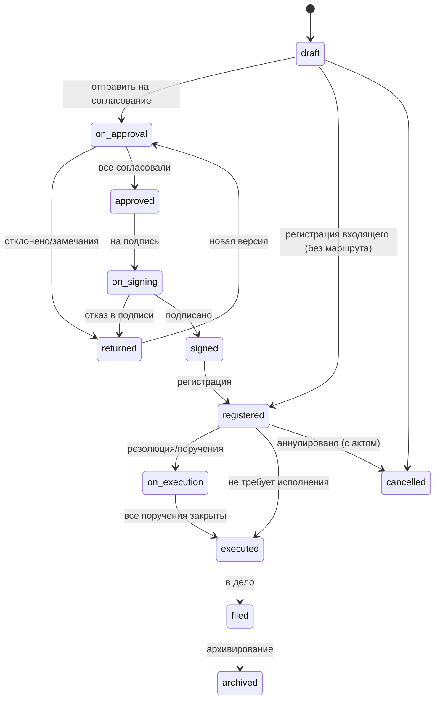

# Документооборот

Статус: **Решено** для жизненного цикла, регистрации, маршрутов через движок процессов, резолюций → поручений и контроля, грифов и допусков (ADR-0080); **Рекомендовано** для архива и шаблонов; **Открыто** — квалифицированная электронная подпись. Реализация ядра (первая волна фазы 3) — §17.

## 1. Что такое документ в kchs

Документ — объект реестра с типом, карточкой (набор полей по схеме типа), версиями файлов, регистрационными реквизитами, маршрутом (процесс), резолюциями, поручениями, связями с другими документами и объектами (территория, датасет, дашборд, встреча), обсуждением и историей. Документ участвует в общих механизмах: поиск (включая текст вложений после OCR), Входящие, уведомления, шаринг, аудит.

## 2. Типы документов и карточки

`document_types` задаёт: направление (`incoming`/`outgoing`/`internal`), схему карточки (поля системы типов: текст, дата, корреспондент, подразделение, пользователь, территория, справочник, файл, число…), нумерацию (журнал и формат), маршрут по умолчанию, допустимые грифы, срок хранения, печатные формы, правила (обязателен скан, разрешены резолюции, ознакомление при регистрации, автоконтроль сроков).

Стартовый набор (seed, редактируемый): Входящее письмо, Исходящее письмо, Служебная записка, Докладная записка, Приказ, Распоряжение, Протокол, Договор/Соглашение, Обращение, Отчёт (регистрируемый), Донесение (для предметного пакета).

## 3. Жизненный цикл

Переходы выполняет движок процессов по определению маршрута типа документа; статусы документа — производные от состояния процесса и явных действий (регистрация, «в дело»). Ручное изменение статуса запрещено, кроме `cancelled` со способностью и обоснованием.

## 4. Маршруты (процессы)

Маршрут — `process_definition` для `object_type='document'`. Шаги: `approval` (параллельно/последовательно/любой из; сроки в рабочих днях или, для экстренных маршрутов, в календарных часах — ADR-0131; условия — например, «если сумма > X, добавить финансиста»), `sign`, `register`, `acknowledge` (ознакомление списка), `task` (создать поручения из резолюции), `condition`, `notify`, `wait`. Назначения — выражениями над оргструктурой (`unit_head(author.unit)`, `manager(author)`, `role_in_space('legal')`, `chosen_by_initiator`, `field('signer')`).

Правила согласования:
- Версия, отправленная на согласование, **замораживается** (`is_final` для этапа); замечания — комментарий и/или файл с правками; отклонение возвращает автору.
- После новой версии — повторное согласование: полное или только отклонивших (настройка типа).
- Согласующий может **делегировать** шаг (в рамках делегирования) или **добавить согласующего** (если разрешено).
- Каждый шаг — элемент Входящих с дедлайном, напоминания (за 1 день, в день, просрочка) и эскалация руководителю согласующего.
- Лист согласования формируется автоматически (печатная форма и PDF-приложение).

Конструктор маршрутов — визуальный (список шагов с вложенными параллельными группами), с проверкой определения и предпросмотром «кто будет назначен» для примера документа.

Реализовано (ADR-0087): конструктор — раздел консоли «Маршруты процессов» (способность `processes.manage`) и вкладка маршрута. Схема — основная линия от первого шага, параллельные группы с ветвями внутри, ниже — прочие цепочки (возвраты, ветви условий, недостижимые шаги) с подписью «переход сюда»; «+» вставляет шаг (в ветвь — без условий, возвратов и завершения), меню карточки сдвигает и удаляет его со сшивкой переходов. Инспектор шага правит поля по типу: назначенных — словами (руководитель подразделения автора, роль, переменная, поле, сотрудник поиском, произвольное выражение), порядок и кворум, срок в рабочих днях или часах (ADR-0131), переход при отклонении, ключ — с переименованием ссылок. Настройки маршрута — название, первый шаг, переменные запуска, эскалация при просрочке и условия запуска. Проверку делает сервер на лету, ошибка ведёт к шагу; предпросмотр назначений — на выбранном объекте с переменными и выбором инициатора; JSON — для редких конструкций; черновик, публикация и история версий («взять за основу»).

## 5. Регистрация и нумерация

- Журналы (`journals`): название, типы документов, формат номера (по умолчанию `{case.index}/{seq}` — «подразделение-дело/номер», `03-12/145`, ADR-0134; также `{prefix}`, `{seq:04}`, `{yy}`, `{yyyy}`, `{mm}`, индекс подразделения `{unit.code}`), сброс счётчика (год/никогда), подразделение-владелец. Счётчики — `journal_counters` с блокировкой строки в транзакции регистрации; резервирование номеров (для бумажных) — отдельная операция с пометкой.
- Регистрация входящего: карточка (корреспондент, исходящие реквизиты, дата поступления, способ доставки, суть, приложения, гриф), скан (drag-and-drop, со сканера через загрузку папки, с телефона) → OCR → **автозаполнение полей ИИ** с подсветкой уверенности (подтверждение человеком обязательно) → номер → штамп регистрации на PDF (печатная форма) → отправка руководителю на резолюцию (по правилу типа: `unit_head(...)`).
- Реализовано (ADR-0088): помощник регистрации — «Заполнить по скану»: модель по извлечённому тексту скана предлагает тему, краткое содержание, исходящие реквизиты отправителя и простые поля карточки с уверенностью и цитатой, отправитель сверяется со справочником корреспондентов; в карточку значение попадает только нажатием «Принять». Документы с грифом строже порога установки (`AI_DOCUMENTS_MAX_CONFIDENTIALITY`, по умолчанию «ДСП») модели не отдаются.
- Регистрация из почты: интеграция IMAP создаёт черновики входящих с вложениями; дедупликация по Message-ID.
- Реализовано (ADR-0113): ящик канцелярии — интеграция `imap` (конфигурация, зашифрованный пароль, «Проверить соединение», журнал синхронизаций); опрос — в общем планировщике. Письмо становится черновиком входящего: тема, текст письма в «суть», корреспондент по адресу (не нашёлся — очередь предлагает завести), вложения — файлами документа, а первое из них — основным файлом первой версии, то есть сканом. Объектом реестра письмо не становится: им становится черновик, а письмо остаётся записью очереди «Из почты» (способность `documents.register`) с предпросмотром, кнопкой «Зарегистрировать» (обычная карточка и номер из журнала) и отклонением с причиной. Дедупликация — уникальный ключ (ящик, `Message-ID`); письмо, не прошедшее правила отбора или не разобравшееся, помечается в очереди с причиной, а не теряется.
- Реализовано (ADR-0134): индекс дела по номенклатуре в номере. При регистрации дело подбирается по типу и подразделению документа (единственное лучшее совпадение среди открытых дел года регистрации), делопроизводитель может выбрать другое или «Без дела»; без дела `{case.index}` берёт префикс журнала. Дело регистрации хранится отдельно от дела подшивки (`documents.reg_case_id`) и предлагается подшивке первым; предпросмотр номера — `GET /documents/{id}/number-preview`. Стартовые журналы «Входящие», «Исходящие», «Внутренние», «Договоры», «Обращения граждан» — в новом формате, приказы и распоряжения — `001-ПР/26`.
- Печатные формы: регистрационная карточка, штамп, лист согласования, лист ознакомления, реестр отправки — HTML-шаблоны → PDF (Playwright).

## 6. Резолюции и поручения

Резолюция — запись руководителя по зарегистрированному документу: текст, ответственный исполнитель, соисполнители, срок (дата или «N рабочих дней»), контроль (и контролёр — по умолчанию помощник/канцелярия подразделения), возможна вложенная резолюция (руководитель управления → начальник отдела). Сохранение резолюции **в той же транзакции** создаёт поручения (`tasks.kind='instruction'`, `source={document, resolution}`) ответственному и соисполнителям (соисполнители — подзадачи «в части касающейся»), элементы Входящих, уведомления. Быстрый ввод: шаблоны резолюций («Прошу рассмотреть и доложить», «К исполнению»), выбор исполнителя из структуры, голосовой ввод на мобильном.

Исполнение: исполнитель отчитывается (текст + вложения/ссылки на подготовленный документ) → контролёр/автор резолюции принимает или возвращает → при закрытии всех поручений документ переходит в `executed`. Продление срока — запрос через Входящие автору резолюции с аудитом.

Контракт с модулем задач (ADR-0082, `modules/tasks/public.ts`):

- `Instructions.create(tx, ctx, input)` — в транзакции сохранения резолюции: `input.source = {kind: 'resolution', objectId: <документ>, resolutionId, label?}`, `assigneeId` (ответственный), `coAssigneeIds` (соисполнители — части «в части касающейся» с контролем у ответственного), `controllerId`, `due = {at: <дата>} | {workingDays: N}` (рабочие дни — по производственному календарю), `authorId` (автор резолюции, если её вносит помощник), `title`, `description`, `priority`, `spaceId` (по умолчанию — пространство документа). Возвращает `{id, key, parts}`; Входящие, уведомления, история сроков и события — внутри.
- `Instructions.status(documentId)` — `{total, open, accepted, cancelled, allClosed, resolutionIds}` с частями соисполнителей; `Instructions.bySource(ctx, documentId)` — поручения документа, видимые смотрящему (вкладка «Резолюции и поручения»; то же — `GET /tasks/by-source?objectId=`).
- Событие `task.source_closed` (объект события — документ; `resolutionIds`, итоги) публикуется ровно один раз — в транзакции приёмки или отмены последнего открытого поручения документа; подписчик модуля документов переводит документ в `executed`. Отменённые поручения закрытию не мешают.
- Отчёт исполнителя принимают автор и контролёр поручения; продление решает автор поручения (автор резолюции), без него — контролёр.

## 7. Контроль исполнения

Экран «Контроль» (роли: руководители, контролёры, канцелярия): матрица по подразделениям/исполнителям — в срок / срок сегодня / просрочено / продлено; фильтры по документам, периодам, контролёрам; дашборд контроля на показателях `instructions.overdue`, `instructions.on_time_rate` (реализованы как обычные показатели над системным датасетом «Поручения», который платформа поддерживает автоматически — **системные датасеты** для задач, документов, встреч дают аналитику без отдельного кода).

Реализовано (ADR-0082):

- Системный датасет «Поручения» (`instructions`, представление `ds.sys_instructions`) — поручения с подразделением исполнителя, источником, сроками, числом продлений и **состоянием контроля**, вычисляемым при чтении: `open`, `overdue`, `done_on_time`, `done_late`, `cancelled` («срок сегодня» — фильтр по дню в поясе смотрящего; исполнено в срок — по времени принятого отчёта). Строки видит тот, кто видит поручение: участник, руководитель исполнителя (транзитивно), системный администратор и аудитор безопасности.
- Экран «Контроль»: матрица «подразделения исполнителей × в срок / срок сегодня / просрочено / продлено / исполнено в срок / с опозданием / всего», числа — ссылки на список поручений ячейки (по умолчанию — просроченные); фильтры — период срока, подразделение с вложенными, исполнитель, контролёр, источник (резолюции, объекты, строки данных, без источника), части соисполнителей; динамика по неделям срока; плитки показателей; выгрузка матрицы или списка в CSV и XLSX. Всё — запросами компилятора к системному датасету с правами смотрящего.
- Показатели `instructions.overdue` (открытые просроченные основные поручения; разрезы — подразделение, исполнитель, контролёр) и `instructions.on_time_rate` (доля принятых в срок по дате закрытия, месяц к прошлому) — обычные показатели над системным датасетом (`metrics.system_source`), их заводит сид в пространстве организации; их можно ставить на дашборды и настраивать пороги.

## 8. Версии, файлы, шаблоны

- Версия документа = основной файл (DOCX/PDF/иное) + приложения; PDF-представление создаётся автоматически (LibreOffice) для просмотра, штампов и подписи; хэш версии фиксируется.
- Шаблоны DOCX с плейсхолдерами (`{{doc.subject}}`, `{{doc.fields.addressee}}`, `{{author.position}}`, таблицы/циклы docxtpl) — «Создать по шаблону» заполняет карточку и генерирует файл; редактирование в ONLYOFFICE (фаза 3) или загрузка новой версии.
- Сравнение версий: текстовый diff (извлечение текста) и визуальный (PDF рядом).

## 9. Подпись

- **Простая электронная подпись** (фаза 1): действие «Подписать» под аутентифицированным сеансом с MFA-подтверждением (настройка), фиксирует хэш версии, время, подписанта, ИД сессии; формируется лист подписи (PDF) и штамп на PDF-представлении; проверяется в карточке.
- **Квалифицированная подпись** (Открыто): порт `SignatureProvider` с операциями `prepare(hash)`, `attach(signature)`, `verify()`; реализации: клиентский плагин (браузерное расширение/КриптоПро-подобное) или серверный сервис подписи; формат CAdES/PDF-подпись. Определить по требованиям законодательства РТ.

## 10. Ознакомление

Список лиц/подразделений → элементы Входящих «Ознакомиться» → отметка (с MFA по настройке) → лист ознакомления; отчёт «кто не ознакомился» с напоминаниями. Общий механизм `acknowledgments` используется и для страниц базы знаний.

## 11. Связи документов

`reply_to` (ответ на входящее), `in_execution_of` (во исполнение приказа), `cancels`, `amends`, `related`, `attachment` (файлы), `about_territory`, `source` (создан из отчёта/протокола). Панель «Связи» показывает цепочку переписки; из входящего одним действием создаётся исходящий-ответ с наследованием корреспондента и связи.

## 12. Дела и архив

Номенклатура дел (`cases`: индекс, заголовок, срок хранения, подразделение, год) ведётся канцелярией; документ после исполнения «подшивается» в дело (обязательное поле при переходе в `filed`, предлагаемое по типу и подразделению). Закрытие дела по году, передача в архив (статус), опись дела (печатная форма), акт о выделении к уничтожению по истечении срока; уничтожение — удаление файлов с сохранением карточки-описи (аудит). Поиск в архиве — как в общем поиске с фильтром статуса.

## 13. Конфиденциальность

Грифы: `public` (в пределах организации), `internal` (для служебного пользования), `confidential`. Гриф «Секретно» снят решением владельца (N10, ADR-0142): гостайна обрабатывается только в аттестованных системах, прежние значения стали `confidential`. Допуск пользователя — атрибут; доступ к документу с грифом строже допуска невозможен независимо от ACL; вложения конфиденциальных документов помечаются водяными знаками при просмотре, экспорт — с аудитом; уведомления не содержат содержания, только «документ №…».

Решено (ADR-0080): гриф — столбец реестра `objects.confidentiality`, проверка — механизм ядра, общий для всех типов объектов и всех путей доступа (проверка прав, списки, поиск, уведомления, realtime, гостевые ссылки, связи, системные датасеты). Допуск — `users.attributes.clearance`, по умолчанию `internal`; задаёт администратор системы с основанием. Вложение закрыто самым строгим грифом документов, к которым прикреплено. Обезличивание в уведомлениях, письмах, Telegram и Входящих — от `confidential`. Администратор системы видит документы выше своего допуска только в «режиме администратора» (обоснование, срок 5–120 минут, аудит каждого действия). Водяные знаки — §18 (ADR-0085).

## 14. Отчёты по документообороту

Системный датасет «Документы» → показатели: объём регистрации по типам/периодам, средний срок согласования по маршрутам/согласующим, доля просроченных, нагрузка на исполнителей, движение по журналам. Дашборд «Канцелярия» из seed.

## 15. Интерфейс

Карточка документа (см. `03-ui/03-screens.md`): шапка (номер, тип, статус, гриф, срок, контроль), вкладки «Карточка», «Файлы/версии», «Маршрут» (визуальная линия шагов с текущим), «Резолюции и поручения» (дерево), «Связи», «Ознакомление», «История»; контекстная панель с обсуждением и действиями шага (Согласовать / Замечания / Отклонить / Подписать). Список документов — `CollectionView` с сохранёнными представлениями («Мои на согласовании», «Просроченные на контроле», «Журнал входящих 2026»).

## 16. Открытые продуктовые вопросы

1. Юридические требования к ЭЦП и форматам подписи.
2. Официальные формы журналов/реестров и требования архивного законодательства.
3. Нужна ли межведомственная отправка (СМЭВ-подобные шлюзы) — точка расширения `integrations`.

## 17. Реализация ядра (первая волна фазы 3, ADR-0080)

- **Объекты и таблицы.** `document`, `document_type`, `journal`, `correspondent` — объекты реестра в системном пространстве «Документооборот» (без участников); таблицы — `05-data-model.md` §Документы. Реквизиты и сводные поля реестра (`title`, `subtitle` = номер, `meta`) ведёт модуль: общий `PATCH /objects/{id}` для этих типов закрыт.
- **Стартовый набор** (`kchs init`, `db:seed`, идемпотентно): 11 типов §2 и 7 журналов — «Входящие» (`ВХ-0001/26`), «Исходящие» (`ИСХ-…`), «Внутренние» (`ВН-…`), «Приказы» (`001-ПР/26`), «Распоряжения» (`001-РП/26`), «Договоры» (`ДГ-…`), «Обращения граждан» (`ОГ-…`); у типа «Обращение» срок по умолчанию — 15 рабочих дней, автоконтроль — у входящего письма, приказа, распоряжения, обращения и донесения; демо-сид добавляет корреспондентов.
- **Нумерация** — §5 без изменений; подстановки шаблона: `{prefix}`, `{seq}`/`{seq:NN}` (ровно одна), `{yy}`, `{yyyy}`, `{unit.code}`. Резерв: `POST /journals/{id}/reservations` (до 50 номеров с примечанием), снятие — `DELETE …/reservations/{id}`; зарегистрированный с резервом документ помечен «номер из резерва».
- **Статусы** меняет только `applyTransition` модуля (граф §3 в `packages/contracts`); в первой волне — регистрация (входящий — без маршрута) и аннулирование с причиной. Вторая волна (движок процессов) вызывает тот же `DocumentsPublic.applyTransition`, выдаёт права участникам маршрута и исполнителям резолюций через `DocumentsPublic.setParticipants` своего источника и регистрирует шагом `register` через `DocumentsPublic.register`.
- **Права.** Автор — владелец; ответственный, подписант, контролёр — `comment` через тихие записи ACL; делопроизводители — записи ACL журнала, документы после регистрации — дочерние объекты журнала; ведение журналов и типов — способность `documents.journals.manage`.
- **Версии** (§8): основной файл и приложения — файлы-вложения документа; хэш SHA-256 и PDF-представление считает движок (задание `render:document.pdf`), PDF-источник — сам себе представление. Штампы, печатные формы, шаблоны DOCX, сравнение версий — §18.
- **Системный датасет «Документы»** — источник `{"kind": "system", "name": "documents"}` (представление `ds.sys_documents`): строки только видимых смотрящему документов и не строже его допуска.
- **Интерфейс** (§15): экран «Документы» (навигатор «Все», «Мои», «На контроле», «Просроченные», «Черновики», «Архив» и журналы; таблица; «Зарегистрировать», «Создать»), регистрация входящего (скан слева, карточка справа), карточка с вкладками «Карточка», «Файлы и версии», «История»; «Маршрут», «Резолюции и поручения», «Связи», «Ознакомление» и действия шага — слоты второй волны (`apps/web/src/features/documents/card/*-tab.tsx`, `step-actions.tsx`, `registration/registration-assist.tsx`); справочники журналов, корреспондентов и типов; допуск и режим администратора — в консоли администрирования.

## 18. Маршруты документов (вторая волна фазы 3, ADR-0083)

- **Движок.** Маршрут — опубликованное определение движка процессов для `objectType: 'document'` (ADR-0079); модуль — поставщик данных `document` (реквизиты для `field:`, свойства `object.typeKey`, `object.direction`… для условий) и исполнитель шага `register`. Статусы §3 меняют хуки перехода через `applyTransition` (причина `process`): согласование → «На согласовании» → «Согласован», подпись → «На подписи» → «Подписан», возврат → «Возвращён», регистрация шагом → «Зарегистрирован». В граф добавлены `draft|returned → on_signing` (маршрут без согласования) и `returned → cancelled` (аннулирование возвращённого с отзывом маршрута).
- **Запуск** — «Отправить на согласование» в карточке: маршрут типа по умолчанию или другой опубликованный, выбор согласующих для шагов `chosen_by_initiator`, переменные, предпросмотр «кто будет назначен». До запуска проверяются право правки и статус (черновик или возвращённый), наличие версии, реквизиты регистрации (если маршрут регистрирует), назначенные безусловных шагов и допуск к грифу у всех назначенных.
- **Версия** согласования и подписи замораживается при активации шага (`is_final`, версия за шагом); пока документ на согласовании или подписи, новая версия не добавляется — после возврата автор загружает новую и отправляет повторно (правило `reapproval` шага возврата: полностью или только не одобрившие).
- **Подпись** — простая ЭП: хэш SHA-256 подписанной версии, подписант, заместитель, сессия, код второго фактора (`requireMfa`); проверка в карточке сравнивает хэш подписи с хэшем версии. Квалифицированная подпись — открытый вопрос §9 (маршрут с ней не запускается).
- **Регистрация** — шаг `register`: назначенный делопроизводитель регистрирует из Входящих (способность и право на журнал, без права правки документа), без назначенных — сразу после подписи; журнал — из шага или типа. Пока идёт маршрут, ручная регистрация из карточки закрыта.
- **Права.** Назначенный идущего шага видит и обсуждает документ, после шага — видит (политика типа `withProcessParticipants`, принципалы — в поиске и системном датасете). Эскалация тем, кто документ не видит, — без содержания.
- **Стартовые маршруты** (`kchs init`, `db:seed`, идемпотентно): «Исходящее: согласование, подпись, регистрация» (юрист и профильный отдел по выбору ∥ → заместитель руководителя → подпись с кодом → регистрация канцелярией), «Приказ: согласование, подпись, регистрация» (приказ, распоряжение), «Служебная записка: подпись руководителя подразделения» (служебная и докладная записки).
- **Интерфейс.** Вкладка «Маршрут» — линия шагов по кругам (назначенные и ответы, засчитанные одобрения, сроки, просрочка, решения с комментариями и файлами, версия шага), история маршрутов, отзыв, подписи; действия шага — в контекст-панели; текущий шаг и ждущие — в шапке карточки. Конструктор маршрутов, лист согласования и подписи (печатные формы), ознакомление и резолюции — отдельные части второй волны.

## 19. Резолюции, исполнение, ознакомление (вторая волна фазы 3, ADR-0084)

- **Направление на резолюцию** — правило типа `settings.resolutionBy`: `unit_head` (руководитель подразделения документа, без него — ближайший вышестоящий; у входящего письма, обращения и донесения стартового набора), `user` (выбранный сотрудник), `none`. Выполняется в транзакции регистрации; вручную направляет делопроизводитель, получатель переадресует. Получатель читает и обсуждает документ, во Входящих — дело `resolve` с действиями «Наложить резолюцию» (форма в карточке) и «Не требует исполнения».
- **Резолюция** (`POST /documents/{id}/resolutions`): текст, ответственный, соисполнители, срок датой или «N рабочих дней», контроль и контролёр, родитель для вложенной. В одной транзакции — поручения (`Instructions.create`: ответственному и части соисполнителям, автор — автор резолюции, гриф — документа), права участников `resolution:<id>`, закрытие направления, `registered → on_execution`, контроль документа (срок и контролёр — если их не было). Контролёр по умолчанию — контролёр документа, иначе зарегистрировавший (канцелярия).
- **Кто накладывает**: получатель направления; заместитель «от имени» (автор — замещаемый); делопроизводитель от имени руководителя (в аудит); вложенную — ответственный или соисполнитель, срок не позже родительского. Исполнители — с допуском к грифу документа.
- **Исполнение**: закрытие последнего поручения (`task.source_closed`) — документ «Исполнен», контроль снят. «Не требует исполнения» — `registered → executed` без поручений. Документ закрыт (исполнен, подшит, в архиве, аннулирован) — открытые направления снимаются (`cancelled`) подписчиком смены статуса: на закрытый документ резолюцию не наложить.
- **Шаблоны резолюций** — общие (канцелярия) и личные, `GET/POST/PATCH/DELETE /resolution-templates`; стартовые общие — миграция.
- **Ознакомление** — механизм ядра (`/objects/{id}/acknowledgments`: список, «Ознакомлен», «Напомнить»); документ отправляет на ознакомление `POST /documents/{id}/acknowledgments` (сотрудники, подразделения, группы; срок; код второго фактора) и знакомит при регистрации по правилу типа (`ackOnRegister`, `ackUnitIds`, `ackDueWorkingDays`, `ackRequireMfa`; приказы и распоряжения — 3 рабочих дня). Шаг маршрута `acknowledge` ведёт тот же учёт; отметка из карточки по шагу — решение шага. Пропущенные — без допуска к грифу и уже ждущие.
- **Календарь** — проекция «Сроки документов на контроле» ответственному и контролёру.
- **Интерфейс** — вкладки «Резолюции и поручения» (направления, дерево резолюций с поручениями и их состоянием, действия) и «Ознакомление» (кто ознакомился и когда, кто ждёт и просрочил, запросы, отметка, отправка, напоминание); правила в справочнике типов.

## 20. Дела и архив, переписка, «Канцелярия» (вторая волна фазы 3, ADR-0086)

- **Номенклатура дел** — объекты реестра `case` (индекс уникален в году, срок хранения или «постоянно», подразделение, типы документов); ведут владельцы `documents.journals.manage`, подшивают делопроизводители (ACL дела `role:registrar`). Подшитый документ остаётся под своим журналом — права дело не меняет.
- **Подшивка** (`POST /documents/{id}/file`): исполненный документ или зарегистрированный без контроля («не требует исполнения», `registered → executed → filed`); дело предлагается по типу и подразделению документа, а дело из номера (ADR-0134) — первым.
- **Дело**: закрыть / открыть снова / закрыть дела года; «Передать в архив» — документы дела `filed → archived`; акт о выделении к уничтожению — только дела в архиве с истёкшим сроком (с 1 января года, следующего за годом дела, плюс срок): файлы удаляются (байты — заданием в той же транзакции), карточки документов остаются описью, аудит.
- **Переписка**: «Ответить» на зарегистрированный входящий — черновик исходящего с темой, корреспондентом и грифом входящего, связь `reply_to`; отметки об отправке (реестр отправки) — первая исполняет исходящий; цепочка переписки по `reply_to` в обе стороны, недоступные документы — без реквизитов.
- **Связи** (§11): виды `reply_to`, `in_execution_of`, `cancels`, `amends`, `related`, `source`, `about_territory` — связи ядра; вкладка «Связи» группирует по виду и направлению.
- **Представления**: «На согласовании у меня», «Мои на контроле», «Просроченные на контроле», «К отправке», «Журнал входящих <год>», «Архив»; поля списка «Дело», «Отправлен», «Дан ответ», «В ответ на». Поиск в архиве — общий поиск с фильтром статуса (`GET /search?statuses=filed,archived`).
- **«Канцелярия»** (§14): показатели `documents.registered`, `documents.overdue_on_control`, `documents.overdue_share` над системным датасетом «Документы» и дашборд «Канцелярия» — из сида; в навигаторе документов — ссылка на дашборд.
- **Демо-документы** — около двухсот синтетических документов с номенклатурой дел по годам (`db:seed`, профиль demo); поверх них — документооборот в работе: исходящие на разных шагах маршрута «Исходящее письмо», записки на подписи руководителя подразделения, резолюции руководителей по их направлениям с поручениями сотрудникам (метка `demoFlow`, повтор ничего не добавляет).

## 21. Печатные формы, шаблоны, водяные знаки, сравнение версий (вторая волна, ADR-0085)

- **Реестр печатных форм** — шов для всех модулей: форма (`PrintFormDefinition`) — ключ, подпись, тип объекта (`document`, `journal`), параметры (`period`), причина недоступности и сборка HTML с правами печатающего; разметка — только через `html` с экранированием. Чтобы добавить форму: описать её, зарегистрировать `DocumentsPrint.register(форма)` при старте модуля, добавить ключ в `printForms` типа документа (журналу и другим объектам форма видна всегда), подпись — `documents.print.forms.<ключ>`. Встроенные: регистрационно-контрольная карточка, PDF со штампом регистрации, реестр отправки журнала за период (строки — видимые печатающему, до года и 2000 строк). Листы согласования, подписи, ознакомления и опись дела добавляют их ветки той же регистрацией.
- **Рендер.** Заказ — строка `document_renders` и задание движка `render:document.render` в одной транзакции; план движок берёт у api в момент рендера — права и допуск заказчика проверяются тогда же; результат — PDF, прикреплённый к объекту (доступ и гриф объекта), виден во вкладке «Файлы и версии» → «Печатные формы и шаблоны». Печать объекта с грифом от «конфиденциально» — в аудит.
- **Штамп регистрации** — на копии PDF-представления текущей версии, отдельным файлом (хэш и подпись версии не меняются); ставится сам после регистрации или готовности PDF для типов с `registration_stamp`; правый нижний угол первого листа: организация, «Вх. № …», дата (N18).
- **Шаблоны DOCX** — объект реестра `template` (справочник: виден всем, ведут владельцы `documents.journals.manage`). Плейсхолдеры — `{{ doc.subject }}`, `{{ doc.reg_number }}`, `{{ doc.fields.<ключ> }}`, `{{ doc.correspondent.name }}`, `{{ author.short_name }}`, `{{ signer.position }}`, `{{ org.name }}`, `{{ today }}`, циклы по `doc.attachments`; значения — готовые строки на языке автора. Движок разбирает шаблон (известные и неизвестные плейсхолдеры видны в справочнике) и заполняет его docxtpl в песочнице Jinja. «Создать по шаблону» — черновик с карточкой шаблона, первая версия — файл от движка; «По шаблону» в карточке — новая версия. Стартовый набор содержит бланк исходящего письма.
- **Водяные знаки** — файлы с действующим грифом от «конфиденциально»: просмотр — со знаком (гриф, имя смотрящего, время), исходник — только в режиме администратора (аудит), остальным — копия PDF со знаком на каждом листе (аудит `document.file_exported`, ссылка — только заказчику) (N19).
- **Сравнение версий** — по словам из извлечённого текста (добавленное и удалённое, итог по числу слов) и PDF-представления рядом.
- **Листы и опись** (на том же реестре): лист согласования — по маршрутам документа этапы по кругам, участники, решения с датой и комментарием, версия шага (ADR-0083); лист подписи — подписант, за кого, время, версия, хэш SHA-256 и проверка, код подтверждения; лист ознакомления — по учёту ядра (ADR-0084); опись дела — документы дела, видимые печатающему (ADR-0086). Листы доступны, когда у документа есть маршрут, подписи или запрос ознакомления.
