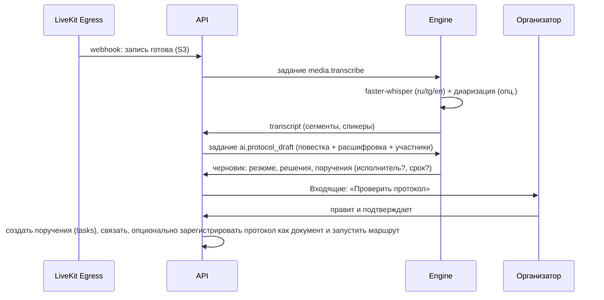

# Коммуникации и встречи

Статус: **Решено** — единые обсуждения и чаты, LiveKit как медиасервер, конвейер «запись → расшифровка → протокол → поручения»; **Рекомендовано** — детали UX и расшифровки.

## 1. Чаты

Виды бесед: личная (`direct`, детерминированный ID по паре пользователей), группа (`group`), канал (`channel`: открытый — вступает любой из пространства; закрытый — по приглашению; канал подразделения создаётся автоматически), обсуждение объекта (`object`). Сообщения: форматирование (Tiptap: жирный, списки, код, цитаты), упоминания `@пользователь`, `@группа`, `#объект` (чип объекта с карточкой), вложения (файлы, изображения с превью, голосовые), реакции, ответы и треды, редактирование/удаление (с историей для аудита), закрепления, пересылка, черновики, поиск по беседе и глобально, отметки прочтения, «непрочитанные с …», уведомления по правилам (все/упоминания/тишина), статусы присутствия (в сети/отошёл/не беспокоить/на встрече — последнее автоматически).

Быстрые действия из сообщения: создать задачу/поручение (с цитатой и связью `source`), прикрепить к документу, начать встречу, сохранить в заметки/страницу, перевести (ИИ).

Интерфейс: список бесед (закреплённые, непрочитанные, каналы, личные, обсуждения объектов), лента с виртуализацией, тред в контекстной панели, композер с вложениями и `/`-командами (`/task`, `/meet`, `/poll` (опц.)).

### Как реализовано (P4-E01, ADR-0090)

Модуль `chat` — надстройка над обсуждениями ядра: сообщения, участники и отметки прочтения
остаются таблицами ядра (`conversations`, `conversation_members`, `messages`, `reactions`),
модуль добавляет виды бесед и то, чего у обсуждения объекта нет.

| Вид | Где живёт | Как видна |
|---|---|---|
| `direct` | системное пространство `chats` | ключ пары `<idA>:<idB>` (уникальный, под advisory-блокировкой), объект `restricted`, обоим — тихая запись ACL `comment` |
| `group` | системное пространство `chats` | `restricted`, владелец — создатель, участникам — тихие записи ACL |
| `channel` открытый | пространство команды или подразделения | `accessMode: inherit` — видит любой участник пространства, вступление заводит строку участника |
| `channel` закрытый | пространство команды или подразделения | `restricted` + записи ACL приглашённых |
| канал подразделения | пространство `unit` | открытый канал с системным ключом `space:<id>`, без владельца; подписчик `space.created` и догоняющий проход воркера, состав — за составом пространства |
| `object` | пространство объекта | как было: доступ равен доступу к объекту |

Таблицы модуля: `chat_conversations` (ключ пары, системный ключ, автор), `chat_pins`,
`chat_drafts` (беседа × пользователь × тред, без события outbox), `user_presence`.

Непрочитанное считается от `conversation_members.last_read_message_id`; если отметки нет —
от вступления в беседу, а в обсуждении объекта — от последнего собственного сообщения.
`firstUnreadMessageId` даёт черту «непрочитанные с …». Список бесед строится одним запросом
с предикатом видимости ядра, разделы — его срезы; «куда вступить» — открытые каналы моих
пространств, где меня ещё нет.

Поиск: по беседе — Postgres (индекс триграмм `messages_text_trgm`, находит сразу после
отправки), глобально — индекс Meilisearch `messages` с фильтром по беседам смотрящего.

Присутствие: выбранный статус «в сети / отошёл / не беспокоить» (с необязательным сроком) и
тихие часы — в `user_presence`; «на встрече» выставляет подписчик
`meeting.participant_joined`/`meeting.participant_left`. Подписчик уведомлений чата
спрашивает статус: при «не беспокоить», тихих часах и встрече остаётся только канал `app`.

Быстрые действия: поручение — `Instructions.create` модуля задач (связь `source`, описание —
цитата; из личной беседы поручение кладётся в личное пространство автора), «прикрепить» —
связь `related` от объекта к беседе, «позвонить» — `startCall` из `modules/meetings/public.ts`.

Маршруты: `/chats` (список и создание), `/chats/{id}` (карточка, переименование,
`/members`, `/join`, `/leave`, `/invite`, `/settings`, `/pins`, `/draft`, `/call`),
`/chats/search`, `/chats/drafts`, `/chats/forward`, `/chats/messages/{id}/task|attach`,
`/me/presence`, `/presence`. События — `chat.*`.

## 2. Обсуждения объектов

У любого объекта — вкладка «Обсуждение» в контекстной панели: та же лента и композер. Системные сообщения о ключевых событиях (отправлен на согласование, статус изменён) вплетены в ленту с фильтром «только люди». Сообщения-решения (согласовано/отклонено с комментарием) визуально выделены. Обсуждения объектов появляются в модуле «Чаты» в разделе «Обсуждения», где я участвую.

## 3. Звонки и встречи (LiveKit)

- Личный/групповой звонок из беседы — `meeting.kind='call'` с комнатой на лету; входящий звонок — realtime-событие + push/Telegram.
- Встреча по расписанию — `meeting` + `event` календаря; ссылка/комната; повестка (Tiptap, совместно), связанные объекты (дашборд, карта, документ — открываются участникам одной кнопкой «Показать всем» = ссылка + демонстрация экрана).
- Клиент: `livekit-client` с собственным UI (сетка/спикер/боковая, поднятая рука, чат встречи = беседа встречи, реакции, демонстрация экрана/вкладки, качество сети, устройства, фон-размытие), комната ожидания и гости по ссылке (токен с ограниченным сроком, имя, без доступа к объектам).
- Запись: LiveKit Egress (composite mp4 в S3) по правам (`meetings.record`) с индикатором всем участникам; после завершения — `recording` ★ (файл, длительность).
- Масштаб: один LiveKit-узел на S1 (до ~20 конференций по 30 участников при 720p, оценка), TURN встроен (для сетей с NAT/файрволами обязателен порт 443/TLS); S2 — несколько узлов.

## 4. После встречи: расшифровка, протокол, поручения

Редактор протокола — Tiptap-документ со структурными блоками: `agenda_item`, `decision`, `instruction {assignee, due, controller}`, `note`; блоки `instruction` при подтверждении становятся поручениями (связь `source=protocol`), их статус отражается в протоколе. Расшифровка привязана к таймкодам — клик по фразе перематывает запись. Качество расшифровки для таджикского — риск (см. риски); всегда есть ручной режим без ИИ.

## 5. Права и конфиденциальность

Беседа видна участникам; обсуждение объекта — тем, кто имеет `comment+` на объекте (`view` — только чтение); записи встреч — участникам и организатору, шаринг как файла; расшифровки — как запись; ИИ-черновики не отправляются вовне до подтверждения. Экспорт истории беседы — способность и аудит. Хранение сообщений — бессрочно (политика хранения настраивается).

## 6. Уведомления

Категории `chat.direct`, `chat.mention`, `chat.channel`, `meeting.invite`, `meeting.starting` (за 5 минут с кнопкой «Присоединиться»), `meeting.protocol_ready`; в Telegram — сообщения и ответы (двусторонний мост для личных чатов — фаза 5, Открыто).
