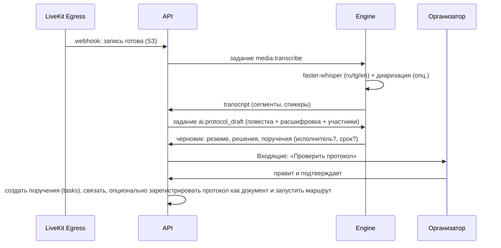

# Коммуникации и встречи

Статус: **Решено** — единые обсуждения и чаты, LiveKit как медиасервер, конвейер «запись → расшифровка → протокол → поручения»; **Рекомендовано** — детали UX и расшифровки.

## 1. Чаты

Виды бесед: личная (`direct`, детерминированный ID по паре пользователей), группа (`group`), канал (`channel`: открытый — вступает любой из пространства; закрытый — по приглашению; канал подразделения создаётся автоматически), обсуждение объекта (`object`). Сообщения: форматирование (Tiptap: жирный, списки, код, цитаты), упоминания `@пользователь`, `@группа`, `#объект` (чип объекта с карточкой), вложения (файлы, изображения с превью, голосовые), реакции, ответы и треды, редактирование/удаление (с историей для аудита), закрепления, пересылка, черновики, поиск по беседе и глобально, отметки прочтения, «непрочитанные с …», уведомления по правилам (все/упоминания/тишина), статусы присутствия (в сети/отошёл/не беспокоить/на встрече — последнее автоматически).

Быстрые действия из сообщения: создать задачу/поручение (с цитатой и связью `source`), прикрепить к документу, начать встречу, сохранить в заметки/страницу, перевести (ИИ).

Интерфейс: список бесед (закреплённые, непрочитанные, каналы, личные, обсуждения объектов), лента с виртуализацией, тред в контекстной панели, композер с вложениями и `/`-командами (`/task`, `/meet`, `/poll` (опц.)).

### Как реализовано (P4-E01, ADR-0090)

Модуль `chat` — надстройка над обсуждениями ядра: сообщения, участники и отметки прочтения
остаются таблицами ядра (`conversations`, `conversation_members`, `messages`, `reactions`),
модуль добавляет виды бесед и то, чего у обсуждения объекта нет.

| Вид | Где живёт | Как видна |
|---|---|---|
| `direct` | системное пространство `chats` | ключ пары `<idA>:<idB>` (уникальный, под advisory-блокировкой), объект `restricted`, обоим — тихая запись ACL `comment` |
| `group` | системное пространство `chats` | `restricted`, владелец — создатель, участникам — тихие записи ACL |
| `channel` открытый | пространство команды или подразделения | `accessMode: inherit` — видит любой участник пространства, вступление заводит строку участника |
| `channel` закрытый | пространство команды или подразделения | `restricted` + записи ACL приглашённых |
| канал подразделения | пространство `unit` | открытый канал с системным ключом `space:<id>`, без владельца; подписчик `space.created` и догоняющий проход воркера, состав — за составом пространства |
| `object` | пространство объекта | как было: доступ равен доступу к объекту |

Таблицы модуля: `chat_conversations` (ключ пары, системный ключ, автор), `chat_pins`,
`chat_drafts` (беседа × пользователь × тред, без события outbox), `user_presence`.

Непрочитанное считается от `conversation_members.last_read_message_id`; если отметки нет —
от вступления в беседу, а в обсуждении объекта — от последнего собственного сообщения.
`firstUnreadMessageId` даёт черту «непрочитанные с …». Список бесед строится одним запросом
с предикатом видимости ядра, разделы — его срезы; «куда вступить» — открытые каналы моих
пространств, где меня ещё нет.

Поиск: по беседе — Postgres (индекс триграмм `messages_text_trgm`, находит сразу после
отправки), глобально — индекс Meilisearch `messages` с фильтром по беседам смотрящего.

Присутствие: выбранный статус «в сети / отошёл / не беспокоить» (с необязательным сроком) и
тихие часы — в `user_presence`; «на встрече» выставляет подписчик
`meeting.participant_joined`/`meeting.participant_left`. Подписчик уведомлений чата
спрашивает статус: при «не беспокоить», тихих часах и встрече остаётся только канал `app`.
С ADR-0140 тишина действует на все уведомления ядра: модуль отдаёт её портом
`kernel/notifications/quiet.ts`, внешние каналы глушатся у всего, кроме срочного.

Быстрые действия: поручение — `Instructions.create` модуля задач (связь `source`, описание —
цитата; из личной беседы поручение кладётся в личное пространство автора), «прикрепить» —
связь `related` от объекта к беседе, «позвонить» — `startCall` из `modules/meetings/public.ts`.

Маршруты: `/chats` (список и создание), `/chats/{id}` (карточка, переименование,
`/members`, `/join`, `/leave`, `/invite`, `/settings`, `/pins`, `/draft`, `/call`),
`/chats/search`, `/chats/drafts`, `/chats/forward`, `/chats/messages/{id}/task|attach`,
`/me/presence`, `/presence`. События — `chat.*`.

Доработка до пилота (ADR-0161):

- автор правит и удаляет своё сообщение 24 ч (`MESSAGE_EDIT_WINDOW_HOURS`), ведущий беседы
  (`manage`, кроме личной) удаляет чужое в любой срок; выдача несёт `can.edit/delete`,
  удалённое остаётся строкой без текста, вложений и реакций;
- отметка прочтения только продвигается и публикует `message.read`: отметки ✓/✓✓ и
  «прочитали N» — по `lastReadMessageId` участников, `chat.changed` — другим вкладкам
  читателя;
- «печатает» — сигнал `typing` шлюза, без записи в базу;
- архив у каждого свой (`conversation_members.archived_at`, раздел `archived`): беседа со
  звуком возвращается с новым сообщением, без звука — остаётся;
- пересылка нескольких (до 20) и треды в обсуждении объекта — в интерфейсе.

## 2. Обсуждения объектов

У любого объекта — вкладка «Обсуждение» в контекстной панели: та же лента и композер. Системные сообщения о ключевых событиях (отправлен на согласование, статус изменён) вплетены в ленту с фильтром «только люди». Сообщения-решения (согласовано/отклонено с комментарием) визуально выделены. Обсуждения объектов появляются в модуле «Чаты» в разделе «Обсуждения», где я участвую.

## 3. Звонки и встречи (LiveKit)

- Личный/групповой звонок из беседы — `meeting.kind='call'` с комнатой на лету; входящий звонок — realtime-событие + push/Telegram.
- Встреча по расписанию — `meeting` + `event` календаря; ссылка/комната; повестка (Tiptap, совместно), связанные объекты (дашборд, карта, документ — открываются участникам одной кнопкой «Показать всем» = ссылка + демонстрация экрана).
- Клиент: `livekit-client` с собственным UI (сетка/спикер/боковая, поднятая рука, чат встречи = беседа встречи, реакции, демонстрация экрана/вкладки, качество сети, устройства, фон-размытие), комната ожидания и гости по ссылке (токен с ограниченным сроком, имя, без доступа к объектам).
- Реализовано (ADR-0091): экран «Встречи» (идущие и мои), карточка встречи со входом, комната с тремя раскладками, выбором устройств, демонстрацией экрана, поднятой рукой, реакциями, показателем качества сети, индикатором записи, списком участников и чатом встречи; выход и «Завершить для всех». Комната создаётся один раз на токен, переподключение — по новому токену (`POST /meetings/{id}/join`), у гостя — повторный вход по той же заявке.
- Входящий звонок: событие `call.incoming` доставляется приглашённому сообщением realtime в комнату `user:{id}` (подписчик `meetings-realtime`) вместе со срочным уведомлением категории `meetings`; экран предлагает принять (открывается вкладка встречи) или отклонить (`POST /meetings/{id}/decline` → `call.declined` звонящему). Состав комнаты и её завершение приходят в комнату `object:{id}` сообщением `meeting.changed`.
- Гость по ссылке: `POST /meetings/{id}/guest-link` выдаёт подписанный токен на срок от 15 минут до суток, страница `/meet/<токен>` живёт вне рабочего пространства. Гость называет имя и ждёт в комнате ожидания; ведущий встречу видит заявки в панели участников и решает, впускать ли. Гостю доступны только комната и её участники — ни чата встречи, ни объектов системы.
- «Показать всем»: участник выбирает связанный со встречей объект, сигнал идёт по каналу данных комнаты (`MeetingSignal`), у остальных объект открывается вкладкой их собственными правами — доступ сигналом не передаётся.
- Запись: LiveKit Egress (composite mp4 в S3) по правам (`meetings.record`) с индикатором всем участникам; после завершения — `recording` ★ (файл, длительность). Реализовано в ADR-0092: запись — объект реестра внутри встречи (доступ наследуется от неё, постороннему 404), включает и выключает её кнопкой в комнате тот, кто ведёт встречу и имеет способность `meetings.record`, индикатор видят все участники; Egress кладёт mp4 прямо в бакет файлов под выданный api ключ и сообщает о готовности подписанным вебхуком (`POST /meetings/webhooks/livekit`), после чего api заводит файл реестра — вложение записи. Если вебхук не дошёл, состояние задания опрашивается у медиасервера. Завершение встречи останавливает идущую запись.
- Масштаб: один LiveKit-узел на S1 (до ~20 конференций по 30 участников при 720p, оценка), TURN встроен (для сетей с NAT/файрволами обязателен порт 443/TLS); S2 — несколько узлов.

## 4. После встречи: расшифровка, протокол, поручения

Расшифровка (ADR-0092): задание `media:media.transcribe` движка — `faster-whisper` по звуковой дорожке (ffmpeg, моно 16 кГц). Модель задаётся `ENGINE_TRANSCRIBE_MODEL` и по умолчанию пуста — тогда задание отвечает «недоступно», а не падает, и интерфейс объясняет, что модель не настроена. Сегменты (`start`, `end`, `text`, `speaker`) хранятся в `transcripts.segments`; диаризации пока нет — composite-дорожка сводит участников в один канал, поэтому `speaker` пуст. Расшифровка доступна тем же, кому доступна запись; в плеере она ищется и выгружается текстом. Правка (ADR-0162): с правом `edit` на записи фразу исправляют на месте (`edited`, исходный текст — `original`), метку говорящего сопоставляют с организатором или участником (`transcripts.speakers`); имена идут в выгрузку и черновик протокола, событие `transcript.edited` обновляет открытые вкладки. Перед входом в комнату — браузерная проверка камеры и микрофона с выбором устройств.

Редактор протокола — Tiptap-документ со структурными блоками: `agenda_item`, `decision`, `instruction {assignee, due, controller}`, `note`; блоки `instruction` при подтверждении становятся поручениями (связь `source=protocol`), их статус отражается в протоколе. Расшифровка привязана к таймкодам — клик по фразе перематывает запись. Качество расшифровки для таджикского — риск (см. риски); всегда есть ручной режим без ИИ.

### Реализовано (P4-E02 S07, ADR-0093)

Протокол — объект реестра `protocol`, **дочерний объекту встречи**; повестка и протокол — один
совместный документ Yjs (`/collab`, ADR-0070), состояния `agenda` → `draft` → `confirmed`.
Права наследуются от встречи: приглашённый участник (уровень `comment` на встрече) читает и
обсуждает протокол; правят организатор и **секретарь встречи** (ADR-0137: роль участника
`secretary`, своя запись `edit` на протоколе; назначает организатор —
`PUT /meetings/{id}/secretary`); организатор (`manage`) подтверждает, регистрирует и отправляет
на ознакомление; посторонний получает 404. Блоки — `agenda_item {speaker}`, `decision`,
`instruction {assignee, due, controller, taskId}`, `note`; заголовок блока — `Y.Text`, тело —
текст Tiptap, поэтому правки двух авторов сливаются.

- **Черновик ИИ** (`POST /protocols/{id}/draft`, право `edit`): повестка, участники номерами и
  расшифровка (через порт с мягкой деградацией — нет расшифровки, черновик только по повестке) →
  резюме, решения и поручения с исполнителем и сроком. Блоки дописываются в открытый документ
  **предложением**; порог грифа установки, способность `ai.use` и аудит без текста — как у
  документов (ADR-0088). Событие `protocol.drafted`.
- **Дело «Проверить протокол»** открывается организатору по `meeting.ended` (протокол заводится,
  если его ещё нет).
- **Подтверждение** (`POST /protocols/{id}/confirm`, право `manage`): каждый блок `instruction`
  становится поручением (`Instructions.create`, источник — протокол), ключ возвращается в блок,
  правка закрывается, публикуется `protocol.confirmed`. Блок без исполнителя или текста — 409 со
  списком `blockIds`; без срока — поручение получает 10 рабочих дней по производственному
  календарю (ADR-0137). Статусы поручений видны в протоколе.
- **Регистрация документом** (`POST /protocols/{id}/register`): черновик документа выбранного
  типа через `DocumentsPublic.create`, связь протокола и документа, `protocol.registered`. Сразу
  заказывается **печатная форма протокола** (`meeting_protocol`: повестка, ход заседания,
  поручения, подписи председателя и секретаря); собранный PDF становится вложением и первой
  версией документа — подписывают его (ADR-0137). Сбой сборки — «Собрать заново»
  (`POST /protocols/{id}/print`). Маршрут согласования и подписи запускается из карточки
  документа (ADR-0083).
- **Ознакомление участников** — механизмом ядра (`Acknowledgments.request`, источник `manual`,
  ADR-0084): права получателей уже есть. По умолчанию просят участников встречи, кроме отправителя —
  он протокол и подтвердил; участник видит просьбу и отмечает «Ознакомлен» прямо во вкладке
  протокола, отправитель — сводку «Ознакомлены N из M».

Веб: вкладка «Протокол» в карточке встречи (редактор блоков, кнопки «ИИ-черновик»,
«Подтвердить», «Зарегистрировать документом», «Отправить на ознакомление», поручения со
статусами); протокол открывается и отдельной вкладкой — из дела Входящих и поиска.

## 4a. Реализация основания встреч (фаза 4, ADR-0089)

- **Объект `meeting`** в системном пространстве «Встречи» (роль в пространстве доступа не даёт):
  организатор — владелец, приглашённые получают уровень `comment` тихими записями ACL, поэтому
  встречу одинаково видят списки, поиск, realtime и `authorize()`. Действия типа: `view`,
  `comment` (чат встречи — обсуждение объекта), `join`, `edit`, `end`/`manage`, `share`, `delete`.
- **Комната медиасервера** — `meeting-<id>`; токен выпускает api по правам участника
  (`roomJoin`, публикация, подписка, данные; `roomRecord` — только со способностью
  `meetings.record`), срок — час. Гость по ссылке получает токен на 15 минут с
  `identity = guest:<uuid>` и не становится пользователем системы.
- **Состояния**: первый вход — `planned → live` (`meeting.started`), выход отмечается у участника,
  `end` закрывает встречу и комнату (`meeting.ended` с причиной и длительностью).
- **Календарь ↔ встречи**: событие с флагом «онлайн-встреча» заводит встречу
  (`MeetingsPublic.ensureMeetingForEvent`), ведёт её состав (`setMeetingParticipants`) и закрывает
  при отмене (`endMeeting`); обратная ссылка — `events.meeting_id`. Модуль встреч в чужие таблицы
  не ходит: событие и беседа приходят идентификаторами.
- **Выключенное состояние**: без `LIVEKIT_URL`, `LIVEKIT_API_KEY` и `LIVEKIT_API_SECRET`
  `GET /meetings/status` отвечает `enabled: false`, карточка встречи приходит с `can.join = false`,
  вход — 503. Браузеру нужен origin медиасервера в CSP (`KCHS_MEDIA_ORIGIN`).

### Срок хранения записей (ADR-0138)

Записи хранятся `meetings.recordingRetentionMonths` месяцев от конца записи (по умолчанию 6,
0 — бессрочно; раздел консоли «Встречи»). Ежедневное задание `meetings.recordings-retention` за
неделю до срока предупреждает организатора, по сроку — не раньше недели после предупреждения —
удаляет запись с файлом, расшифровкой и байтами в хранилище. Не удаляются закреплённые
организатором (`POST /recordings/{id}/pin`) и связанные с протоколом или документом записи;
черновик протокола по расшифровке сам связывает протокол с записью.

## 5. Права и конфиденциальность

Беседа видна участникам; обсуждение объекта — тем, кто имеет `comment+` на объекте (`view` — только чтение); записи встреч — участникам и организатору, шаринг как файла; расшифровки — как запись; ИИ-черновики не отправляются вовне до подтверждения. Экспорт истории беседы — способность и аудит. Хранение сообщений — бессрочно (политика хранения настраивается).

## 6. Уведомления

Категории `chat.direct`, `chat.mention`, `chat.channel`, `meeting.invite`, `meeting.starting` (за 5 минут с кнопкой «Присоединиться»), `meeting.protocol_ready`; в Telegram — сообщения и ответы (двусторонний мост для личных чатов — фаза 5, Открыто).
