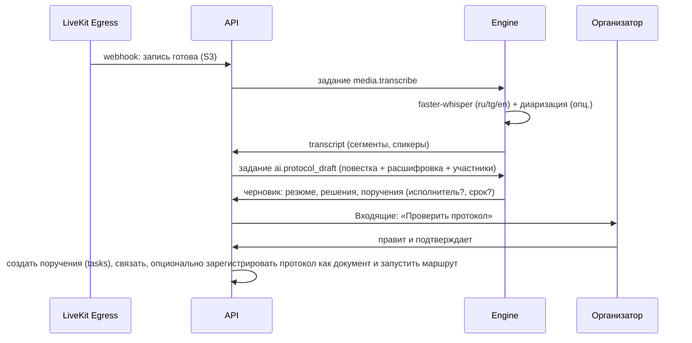

# Коммуникации и встречи

Статус: **Решено** — единые обсуждения и чаты, LiveKit как медиасервер, конвейер «запись → расшифровка → протокол → поручения»; **Рекомендовано** — детали UX и расшифровки.

## 1. Чаты

Виды бесед: личная (`direct`, детерминированный ID по паре пользователей), группа (`group`), канал (`channel`: открытый — вступает любой из пространства; закрытый — по приглашению; канал подразделения создаётся автоматически), обсуждение объекта (`object`). Сообщения: форматирование (Tiptap: жирный, списки, код, цитаты), упоминания `@пользователь`, `@группа`, `#объект` (чип объекта с карточкой), вложения (файлы, изображения с превью, голосовые), реакции, ответы и треды, редактирование/удаление (с историей для аудита), закрепления, пересылка, черновики, поиск по беседе и глобально, отметки прочтения, «непрочитанные с …», уведомления по правилам (все/упоминания/тишина), статусы присутствия (в сети/отошёл/не беспокоить/на встрече — последнее автоматически).

Быстрые действия из сообщения: создать задачу/поручение (с цитатой и связью `source`), прикрепить к документу, начать встречу, сохранить в заметки/страницу, перевести (ИИ).

Интерфейс: список бесед (закреплённые, непрочитанные, каналы, личные, обсуждения объектов), лента с виртуализацией, тред в контекстной панели, композер с вложениями и `/`-командами (`/task`, `/meet`, `/poll` (опц.)).

## 2. Обсуждения объектов

У любого объекта — вкладка «Обсуждение» в контекстной панели: та же лента и композер. Системные сообщения о ключевых событиях (отправлен на согласование, статус изменён) вплетены в ленту с фильтром «только люди». Сообщения-решения (согласовано/отклонено с комментарием) визуально выделены. Обсуждения объектов появляются в модуле «Чаты» в разделе «Обсуждения», где я участвую.

## 3. Звонки и встречи (LiveKit)

- Личный/групповой звонок из беседы — `meeting.kind='call'` с комнатой на лету; входящий звонок — realtime-событие + push/Telegram.
- Встреча по расписанию — `meeting` + `event` календаря; ссылка/комната; повестка (Tiptap, совместно), связанные объекты (дашборд, карта, документ — открываются участникам одной кнопкой «Показать всем» = ссылка + демонстрация экрана).
- Клиент: `livekit-client` с собственным UI (сетка/спикер/боковая, поднятая рука, чат встречи = беседа встречи, реакции, демонстрация экрана/вкладки, качество сети, устройства, фон-размытие), комната ожидания и гости по ссылке (токен с ограниченным сроком, имя, без доступа к объектам).
- Запись: LiveKit Egress (composite mp4 в S3) по правам (`meetings.record`) с индикатором всем участникам; после завершения — `recording` ★ (файл, длительность).
- Масштаб: один LiveKit-узел на S1 (до ~20 конференций по 30 участников при 720p, оценка), TURN встроен (для сетей с NAT/файрволами обязателен порт 443/TLS); S2 — несколько узлов.

## 4. После встречи: расшифровка, протокол, поручения

Редактор протокола — Tiptap-документ со структурными блоками: `agenda_item`, `decision`, `instruction {assignee, due, controller}`, `note`; блоки `instruction` при подтверждении становятся поручениями (связь `source=protocol`), их статус отражается в протоколе. Расшифровка привязана к таймкодам — клик по фразе перематывает запись. Качество расшифровки для таджикского — риск (см. риски); всегда есть ручной режим без ИИ.

### Реализовано (P4-E02 S07, ADR-0093)

Протокол — объект реестра `protocol`, **дочерний объекту встречи**; повестка и протокол — один
совместный документ Yjs (`/collab`, ADR-0070), состояния `agenda` → `draft` → `confirmed`.
Права наследуются от встречи: приглашённый участник (уровень `comment` на встрече) ведёт
повестку и протокол, организатор (`manage`) подтверждает, регистрирует и отправляет на
ознакомление; посторонний получает 404. Блоки — `agenda_item {speaker}`, `decision`,
`instruction {assignee, due, controller, taskId}`, `note`; заголовок блока — `Y.Text`, тело —
текст Tiptap, поэтому правки двух авторов сливаются.

- **Черновик ИИ** (`POST /protocols/{id}/draft`, право `edit`): повестка, участники номерами и
  расшифровка (через порт с мягкой деградацией — нет расшифровки, черновик только по повестке) →
  резюме, решения и поручения с исполнителем и сроком. Блоки дописываются в открытый документ
  **предложением**; порог грифа установки, способность `ai.use` и аудит без текста — как у
  документов (ADR-0088). Событие `protocol.drafted`.
- **Дело «Проверить протокол»** открывается организатору по `meeting.ended` (протокол заводится,
  если его ещё нет).
- **Подтверждение** (`POST /protocols/{id}/confirm`, право `manage`): каждый блок `instruction`
  становится поручением (`Instructions.create`, источник — протокол), ключ возвращается в блок,
  правка закрывается, публикуется `protocol.confirmed`. Блок без исполнителя, срока или текста —
  409 со списком `blockIds`. Статусы поручений видны в протоколе.
- **Регистрация документом** (`POST /protocols/{id}/register`): черновик документа выбранного
  типа через `DocumentsPublic.create`, связь протокола и документа, `protocol.registered`;
  маршрут согласования и подписи запускается из карточки документа (ADR-0083).
- **Ознакомление участников** — механизмом ядра (`Acknowledgments.request`, источник `manual`,
  ADR-0084): права получателей уже есть.

Веб: вкладка «Протокол» в карточке встречи (редактор блоков, кнопки «ИИ-черновик»,
«Подтвердить», «Зарегистрировать документом», «Отправить на ознакомление», поручения со
статусами); протокол открывается и отдельной вкладкой — из дела Входящих и поиска.

## 5. Права и конфиденциальность

Беседа видна участникам; обсуждение объекта — тем, кто имеет `comment+` на объекте (`view` — только чтение); записи встреч — участникам и организатору, шаринг как файла; расшифровки — как запись; ИИ-черновики не отправляются вовне до подтверждения. Экспорт истории беседы — способность и аудит. Хранение сообщений — бессрочно (политика хранения настраивается).

## 6. Уведомления

Категории `chat.direct`, `chat.mention`, `chat.channel`, `meeting.invite`, `meeting.starting` (за 5 минут с кнопкой «Присоединиться»), `meeting.protocol_ready`; в Telegram — сообщения и ответы (двусторонний мост для личных чатов — фаза 5, Открыто).
