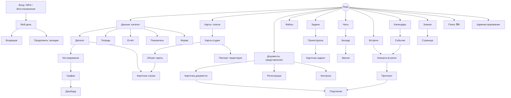

# Основные экраны и переходы

Статус: **Рекомендовано** — описания задают состав, структуру и поведение; пиксельная компоновка — на усмотрение исполнителя в рамках дизайн-системы. Все экраны открываются как вкладки оболочки (кроме входа и печати).

## Карта навигации

## 1. Вход

Центрированная карточка на `--bg-canvas`: логотип/название организации (брендирование), логин/e-mail, пароль, «Войти», ссылка «Не удаётся войти», кнопка SSO и «Войти по ключу» (каждая — если способ настроен, ADR-0098). Второй шаг — MFA: код приложения (6 цифр, автопереход, «использовать код восстановления») и подтверждение ключом — показывается то, что принял сервер. Ошибки — без раскрытия существования учётной записи. После входа — «Мой день» (или «Продолжить»).

## 2. Мой день

Сетка виджетов (12 колонок), режим «Настроить» (перетаскивание, добавление из галереи). Верх: приветствие, дата, погода/обстановка (предметный пакет, опц.), быстрые действия («Создать документ», «Новая задача», «Начать встречу»). См. `02-architecture/12-calendar-notifications-home.md`.

## 3. Входящие

Список слева (группы: Требует решения / Ознакомиться / Поручения / Приглашения / Данные и алерты; фильтры «мои/замещаемые», срок), карточка выбранного справа с контекстом (для документа — карточка с превью PDF и лентой согласования; для поручения — текст, источник, срок) и действиями внизу (первичное — акцентная кнопка). Клавиши: `J/K` перемещение, `A` согласовать, `R` отклонить, `E` открыть, `S` отложить. Массовая отметка «ознакомлен» для нескольких.

## 4. Данные: каталог

Навигатор: пространства → разделы; фильтр по типу (датасеты, дашборды, графики, показатели, тетради, отчёты, формы, источники). Основная область — `CollectionView` (таблица/сетка карточек): название, тип, владелец, строки, обновлён, свежесть/качество (бейдж), теги, использование. Вверху — «Создать» (Загрузить файл / Подключить источник / Датасет вручную / Дашборд / Тетрадь / Отчёт / Форма / Показатель). Пустое состояние — крупный dropzone.

## 5. Датасет

Шапка: имя (inline-edit), пространство, владелец, версия, строк, свежесть, качество, действия (Исследовать, Импорт, Экспорт, Поделиться, ⋯). Вкладки: **Таблица** (DataGrid с панелью фильтров сверху, поиском, кнопкой «Столбцы», выделением, инлайн-правкой, счётчиком «1 245 из 2,3 млн строк», быстрыми сводками по выделению: сумма/среднее), **Схема** (список полей: тип, семантика, формат, индекс, чувствительность; редактор поля справа), **Карта** (если гео), **Версии**, **Качество**, **Связи**, **Формы и расписания**, **Доступ**. Нижняя панель — профиль выбранного столбца (гистограмма/топ-значения). Контекст-панель — Инфо/Происхождение/Обсуждение.

## 6. Импорт (мастер)

Диалог-лист (Sheet) в 4 шага: Файл (dropzone, прогресс) → Структура (лист, строка заголовков, разделитель, кодировка; предпросмотр 50 строк) → Сопоставление (таблица: столбец файла → поле датасета, тип, семантика, пример; авто-детекция; создание гео из lat/lon; ключ; режим загрузки) → Проверка и запуск (сводка, ошибки на выборке, «сохранить как шаблон импорта»). Прогресс задания в строке состояния; по завершении — сводка с кнопкой «Открыть».

## 7. Исследование

Левая колонка (320px) — шаги конструктора (карточки: Источник, Фильтры, Соединения, Вычисления, Сводка, Сортировка, Лимит, Пространственные; «+ шаг»), центр — результат с переключателем Таблица/График/Карта и панелью настройки визуализации (ChartBuilder справа: тип, оси, цвет, опции), верх — имя запроса, «Сохранить как…», «Добавить на дашборд», «В тетрадь», «SQL» (переключение в SqlEditor с показом сгенерированного SQL). Выполнение — авто с дебаунсом 400мс, индикатор времени и «Отменить».

## 8. Дашборд

Режимы: просмотр (панель фильтров сверху, плитки, обновлено «2 мин назад», TV-кнопка) и редактирование (сетка с направляющими, перетаскивание/изменение размера, «+ плитка» из каталога графиков/показателей/карт, настройки плитки в контекст-панели: источник, фильтры, детализация, стиль). Клик по плитке — фокус (увеличение) и кнопки «Открыть запрос», «Данные», «Экспорт». Перекрёстная фильтрация подсвечивает связанные плитки.

## 9. Тетрадь

Документ с ячейками; слева — оглавление; ячейка при фокусе показывает тулбар (тип, запустить, дублировать, удалить); ячейка-запрос: конструктор в компактном виде + результат; ИИ-ячейка: поле вопроса → ответ с графиком и «показать запрос». Параметры тетради сверху. Совместные курсоры.

## 10. Карта-студия

Полноэкранная карта в панели; слева «Слои» (дерево с чекбоксами, ползунок прозрачности, меню слоя: стиль, фильтр, атрибуты, экспорт, удалить), тулбар сверху по центру (курсор, выделение, идентификация, измерение, рисование, закладки, время, печать), поиск сверху слева (адрес/объект/координаты), справа контекст (Объект: атрибуты и связи; Анализ: мастер операций; Стиль: редактор), снизу выдвижная атрибутивная таблица (связанная), справа внизу — масштаб/координаты/базовая карта/легенда (всплывающая). Клик по объекту — карточка-поповер с 3–5 полями и «Открыть»/«Поручение»/«Документы».

## 11. Паспорт территории

Шапка с крошками иерархии и переключателем уровня; сетка показателей (StatTile с искрами и сравнением); карта с границей и тепловой картой объектов; вкладки: Данные (датасеты с этой территорией → таблицы), Объекты (слои), Документы, Поручения, Встречи, Обсуждение, Дочерние территории (таблица с показателями и мини-хороплетом). Всё — переходы во вкладки с предустановленным фильтром территории.

## 12. Документы

Навигатор: сохранённые представления («Мои», «На согласовании у меня», «На контроле», журналы, «Архив»), типы. Основная область — `CollectionView` (таблица: номер, дата, тип, тема, корреспондент, ответственный, срок, статус-бейдж, контроль). Кнопки: «Зарегистрировать», «Создать» (по типу/шаблону). Панель контекста — быстрый просмотр выделенного документа (PDF + маршрут).

**Регистрация**: двухколоночный экран — слева скан (просмотрщик с зумом), справа карточка с полями (подсветка автозаполненных ИИ, клик по полю подсвечивает зону на скане), внизу «Зарегистрировать и отправить на резолюцию».

**Карточка документа**: шапка (тип, номер/дата, статус, гриф, срок, контроль, ответственный), вкладки: Карточка / Файлы и версии (превью PDF рядом со списком версий) / Маршрут (горизонтальная линия шагов с аватарами, статусами, сроками; текущий шаг раскрыт) / Резолюции и поручения (дерево, статусы) / Связи / Ознакомление / История. Контекст-панель: Действия шага (Согласовать / Замечания / Отклонить / Подписать / Наложить резолюцию), Обсуждение.

**Контроль**: матрица подразделения × состояния с числами-ссылками; список просроченных; график динамики; экспорт.

## 13. Файлы

Как файловый менеджер (см. `09-files.md`); предпросмотр в контекст-панели или в отдельной вкладке (полноэкранный просмотрщик с боковой панелью комментариев и версий).

## 14. Задачи

Навигатор: «Мои задачи», «Мои поручения», «Выданные», «На контроле», проекты. Область — `CollectionView` (список с группировкой / доска / календарь / таймлайн). Карточка задачи — как панель (Sheet справа при одинарном клике, вкладка при двойном): заголовок, статус-селектор, свойства (исполнители, срок, приоритет, проект, метки, источник-чип, территория), описание, чек-лист, подзадачи, вложения, результат/отчёт (для поручений — форма «Отчитаться»), обсуждение и активность в контекст-панели.

## 15. Чаты

Три колонки: список бесед (поиск, разделы), лента (виртуализация, дневные разделители, группировка сообщений по автору, треды свёрнуты «3 ответа»), тред/детали в контекст-панели. Композер снизу с вложениями, упоминаниями, `/`-командами, отправкой `Enter` (настраивается). Шапка беседы: участники, звонок, поиск, закреплённые, настройки. На мобильном вебе панель одна: виден либо список бесед, либо беседа с кнопкой возврата; «Чаты» — в нижней навигации.

## 16. Встречи

Список (предстоящие/прошедшие с записями и протоколами). **Комната**: сетка участников (адаптивная), нижняя панель (микрофон, камера, экран, поднять руку, реакции, чат, участники, запись, выйти), правая панель (чат встречи/участники/связанные объекты «Показать всем»), индикатор записи. **После встречи**: экран записи (плеер + расшифровка с таймкодами и поиском) и **Протокол** (редактор с блоками, панель предложенных ИИ решений/поручений с чекбоксами «принять», кнопка «Подтвердить: создать поручения и зарегистрировать»).

## 17. Календарь

Вид неделя по умолчанию; левая колонка — мини-календарь и список календарей с чекбоксами (личный, отдел, проекты, ресурсы, проекции: сроки задач/документов); события — с цветом календаря, значком встречи; клик — поповер с деталями и «Присоединиться»; создание — перетаскиванием. Панель «Найти время» — сетка занятости участников.

## 18. Знания

Навигатор — дерево страниц пространства; страница — редактор с оглавлением справа, шапка (статус, владельцы, срок пересмотра, «Ознакомиться» если требуется), комментарии к фрагментам. Режим «Спросить базу знаний» — панель с ответом и цитатами.

## 19. Поиск

Палитра (`⌘K`) — оверлей по центру: строка ввода, результаты по группам (Недавние, Объекты, Команды, Люди), превью справа при наведении/стрелках. Страница поиска — фасеты слева, результаты со сниппетами, переключатель «Семантический».

## 20. Администрирование

Отдельный модуль с левым меню разделов; формы и таблицы — общие компоненты; «опасные» действия — AlertDialog с вводом подтверждения; аудит — таблица с фильтрами и экспортом; здоровье — карточки сервисов и графики.

Разделы «Каталог (LDAP/AD)» и «Единый вход» (ADR-0098): подключение, соответствие полей и claims, сопоставление групп с ролями; кнопка «Проверить соединение» показывает результат отдельной плашкой, «Предпросмотр» — список планируемых изменений с полями «было → стало», ниже — журнал синхронизаций, из которого открывается разбор любого прогона. Секреты вводятся, но не показываются: подпись поля сообщает, что секрет задан и пустое поле оставит прежний.

Профиль сотрудника: карточка «Ключи входа» — добавление ключа устройства, список с пометкой «подтверждает личность» и отзыв через AlertDialog.

## 21. Печать

Маршруты `/print/*` без оболочки: отчёт, документ (печатная форма), карта, дашборд-снимок — используются Playwright и «Печать» браузера; стили печати из дизайн-системы (чёрный текст, без теней, разрывы страниц).

## Переходы, которые должны работать безупречно

1. Уведомление/Telegram → ссылка → вкладка объекта с нужной вкладкой и элементом (например, документ на шаге согласования с открытой панелью действий).
2. Строка таблицы → «Показать на карте» → карта-панель рядом с выделенным объектом.
3. Плитка дашборда → «Данные» → таблица с фильтрами плитки → строка → карточка → документы по объекту.
4. Сообщение чата → «Создать поручение» → карточка поручения с цитатой и связью → назад в чат по чипу.
5. Встреча → протокол → поручение → документ (зарегистрированный протокол) → маршрут.
6. Паспорт территории → любая вкладка → объект → назад по крошкам без потери состояния.
