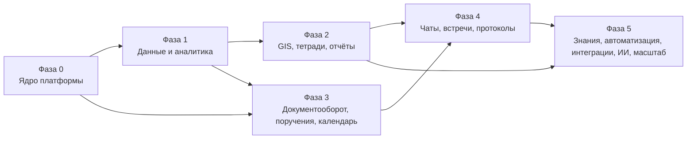

# Дорожная карта реализации

Статус: **Решено** для порядка фаз и критериев готовности; состав историй — в `03-backlog.md`.

## Принципы последовательности

1. **Ядро первым.** Без реестра объектов, доступа, событий и оболочки модули невозможно связать позже без переписывания.
2. **Главный модуль раньше остальных.** Данные (фаза 1) и GIS (фаза 2) сразу после ядра — это продуктовая ценность и самая сложная инженерия.
3. **Каждая фаза — работающий продукт**: разворачивается, засеян демо-данными, проходит сценарии приёмки, имеет обновлённую документацию.
4. **Вертикальные срезы внутри фазы**: сначала тонкий сквозной путь (импорт → таблица → график → дашборд), потом углубление.
5. **Никаких «потом»** для дизайн-системы, тестов и безопасности — они входят в определение готовности каждой истории.

## Фазы

### Фаза 0 — Ядро платформы

**Цель**: оболочка и все общие механизмы; администратор создаёт организацию, пользователи входят, работают в пространствах с файлами, обсуждениями, уведомлениями и поиском.

Состав: монорепо и CI; compose-инфраструктура; БД и миграции; идентификация (пароль, MFA TOTP, сессии, восстановление); пользователи, оргструктура, группы, роли, делегирование (модель); пространства; реестр объектов, предки, корзина; ACL и `authorize`, «объяснить доступ»; связи и зависимости; события/outbox/шина; активность и аудит; обсуждения (беседа объекта, сообщения, упоминания, реакции, вложения); уведомления (приложение, e-mail), Входящие (модель + экран); задания (BullMQ, реестр, прогресс); realtime (Socket.IO, комнаты, presence); поиск (Meilisearch, индексация, палитра команд, страница поиска); файлы (папки, загрузка в S3, версии, превью изображений/PDF, текст); поля и `SchemaForm`, `FilterBuilder`, `CollectionView`, представления; дизайн-система (токены, ~40 базовых компонентов, Storybook, темы, плотность); оболочка (рейл, навигатор, вкладки с предпросмотром и разделением, контекст-панель, строка состояния, палитра, горячие клавиши, сохранение состояния); «Мой день» (Входящие, Продолжить, Недавние); администрирование (пользователи, структура, роли, пространства, аудит, здоровье); i18n ru/tg/en; seed демо-организации; e2e-каркас.

Критерии готовности: сценарии приёмки P0 (`04-verification.md`) проходят; негативные тесты доступа для `space`, `folder`, `file`, `conversation`; p95 API ≤ 200 мс на базовых операциях; Storybook со всеми компонентами в обеих темах; `docker compose up` + `kchs init` дают рабочую систему за ≤ 10 минут.

Порядок внутри фазы: репо/CI/compose → БД/миграции/конфиг → identity → objects/spaces/ACL → events/outbox/jobs → дизайн-система (параллельно с бэкендом) → оболочка → files → discussions → notifications/inbox → search → admin → home → seed/e2e.

### Фаза 1 — Данные и аналитика

**Цель**: аналитик загружает данные, исследует, строит показатели, графики и дашборды; руководитель смотрит дашборды; задачи базово.

Состав: источники-файлы и мастер импорта (CSV/XLSX/JSON/GeoJSON с гео-полями); датасеты (физические таблицы, схема, семантика, версии, история строк, редактирование в гриде, экспорт); `DataGrid`; профили столбцов; связи датасетов и справочники (НСИ, редактор); территории (загрузка справочника, дерево, пикер; без карты); `packages/query`: язык выражений, компилятор, политики строк/столбцов, кэш; Исследование; SQL-лаборатория (libpg-query); показатели (каталог, вычисление, цели/пороги); графики (ChartSpec → ECharts, 10 типов); дашборды (сетка, фильтры, перекрёстная фильтрация, детализация, TV-режим, подписки-снимки PNG); системные датасеты (задачи, документы-заглушка); задачи и проекты (базово: задача/поручение-режим упрощённо, список/доска, карточка, Входящие для назначений); Telegram-бот (привязка, уведомления); e-mail дайджест; ИИ-модуль (провайдер, «спросить данные» v1).

Критерии: сценарий «файл → дашборд за 15 минут»; p95 запросов ≤ 2 с на демо-датасете 5 млн строк; негативные тесты политик строк (через грид, экспорт, SQL, график, API); визуальные тесты графиков.

### Фаза 2 — GIS, тетради, отчёты

**Цель**: полноценная работа с картами и пространственными данными, связанная с таблицами и дашбордами; исследования и официальные отчёты.

Состав: слои и стили (`packages/map-style`, редактор, легенда); тайлы (MVT из PostGIS, кэш, кластеризация, генерализация); базовые карты (PMTiles-пайплайн, реестр); карта-студия (панели, инструменты, поиск, закладки, атрибутивная таблица, связанные представления с гридом/графиками); карты как объекты и плитки дашбордов; редактирование объектов (рисование, формы, история, модерация); импорт/экспорт геоформатов (GDAL в engine, diff-предпросмотр); пространственные шаги QuerySpec и объект «анализ» (буфер, пересечение, spatial join, сетки, ближайший, присвоение территории); территории с геометриями, хороплет-мастер, паспорт территории; время на карте; печать карт; тетради (ячейки, совместное редактирование Yjs/Hocuspocus, ИИ-ячейка); отчёты (шаблоны, параметры, рендер PDF/DOCX через Playwright/docxtpl, расписание, рассылка); геокодер (внутренний индекс).

Критерии: тайлы p95 ≤ 300 мс без кэша на слое 500 тыс. точек; сценарии E и F; редактирование с историей и откатом; отчёт с картой и графиками в PDF идентичен экрану.

### Фаза 3 — Документооборот, поручения, календарь

**Цель**: полный жизненный цикл документа и контроль исполнения; календарь.

Состав: движок процессов (`packages/process` + `kernel/process`), конструктор маршрутов; типы документов и карточки (SchemaForm), журналы и нумерация; регистрация (скан, OCR, ИИ-извлечение), печатные формы; версии и PDF-представление (LibreOffice); согласование/подпись (простая ЭП + MFA)/регистрация/ознакомление; резолюции → поручения (полный режим поручений: принятие, отчёт, приёмка, продление, эскалация, бизнес-календарь); контроль исполнения; шаблоны DOCX; дела и архив; связи документов; корреспонденты; системный датасет «Документы», дашборд «Канцелярия»; календарь (календари, события, RRULE, приглашения, напоминания, проекции сроков, ICS); Telegram-действия (согласовать/принять/ознакомлен); ИИ: резюме документа, черновик ответа.

Критерии: сценарий B целиком; регистрация ≤ 2 минут; негативные тесты доступа к версиям/грифам; аудит подписей; процессы восстанавливаются после перезапуска worker.

### Фаза 4 — Чаты, встречи, протоколы

**Цель**: коммуникации и встречи с результатами.

Состав: полный мессенджер (личные, группы, каналы, треды, присутствие, поиск, закрепления, быстрые действия); LiveKit (комнаты, звонки из чата, встречи по расписанию, демонстрация экрана «показать всем», гости, запись Egress); расшифровка (faster-whisper), плеер с расшифровкой; протокол (редактор, ИИ-черновик, поручения, регистрация как документ, ознакомление); интеграция с календарём и Входящими; push-уведомления (PWA); мобильный веб для чатов/встреч/Входящих.

Критерии: сценарий D; 20 конференций по 30 участников на S1-стенде (нагрузочный тест LiveKit); протокол → поручения → документ за ≤ 10 минут работы организатора.

### Фаза 5 — Знания, автоматизация, интеграции, ИИ, масштаб

**Цель**: полнота платформы и готовность к S2.

Состав: база знаний (страницы, шаблоны, версии, ознакомление, пересмотр, RAG-ответы); автоматизация (правила, конструктор, тестовый прогон, расписания, вебхуки, публичный API-токены); формы сбора данных и контроль сдачи; алерты; качество данных и происхождение; пайплайны преобразований; внешние БД и ГИС-сервисы как источники; IMAP-регистрация; LDAP/AD, OIDC SSO, passkeys; ONLYOFFICE; колоночный tier (DuckDB/Parquet); deck.gl; ИИ-ассистент в контекст-панели с инструментами; администрирование (интеграции, расписания, флаги, брендирование, бэкап-статус); Helm-чарт и нагрузочные тесты S2; предметный пакет ЧС (seed, если A1 подтверждено); документация пользователя и администратора; PWA-полировка.

Критерии: сценарии A, C, G целиком; ZAP без high; восстановление из бэкапа по runbook ≤ 1 ч; Helm-развёртывание на тестовом кластере.

## Что можно распараллелить

Внутри фаз: бэкенд ядра ↔ дизайн-система/оболочка (фаза 0); компилятор запросов ↔ DataGrid/мастер импорта (фаза 1); тайлы/стили ↔ карта-студия (фаза 2); движок процессов ↔ экраны документов (фаза 3). Между фазами: подготовка PMTiles и территорий (данные) — с фазы 0.

## Определение готовности истории (DoD)

1. Реализовано по документу; отклонения оформлены ADR.
2. Unit-тесты логики, интеграционные тесты маршрутов (с негативными проверками доступа), для UI — Storybook-состояния и e2e для сквозных путей.
3. Соответствие дизайн-системе; обе темы; клавиатура; i18n-ключи для всех строк (ru обязательно, tg/en — ключи с заглушками допустимы до фазы 5).
4. События опубликованы, активность/уведомления/индексация работают для новых сущностей.
5. Документация: `docs/progress.md`, при необходимости — правки в `docs/`.
6. Производительность в бюджете (`04-verification.md`), нет предупреждений линтера/типов, нет нарушений границ.
